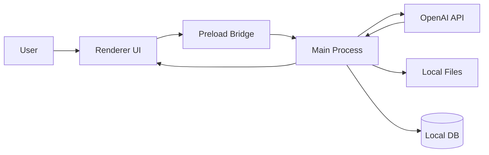

# Image2Tools 技术架构

## 1. 技术栈建议

- 桌面壳：Electron
- 前端：React + TypeScript + Vite
- 状态管理：Zustand 或 Redux Toolkit，二选一即可
- 本地存储：SQLite 优先，其次 JSON/IndexedDB
- 文件处理：Node.js 原生文件系统 + 预加载桥接

## 2. 总体结构



## 3. 分层职责

### Renderer

- 呈现工作台
- 管理 prompt、参数、历史列表
- 管理拖拽上传、画布交互、缩略图展示
- 不直接持有明文 API Key

### Preload

- 暴露安全 IPC
- 提供读取配置、保存配置、下载文件、打开目录等能力

### Main Process

- 负责调用 OpenAI API
- 负责文件读写和下载
- 负责本地加密存储
- 负责错误归类与统一日志

## 4. OpenAI 集成策略

### MVP 采用 Image API

- 文生图：`/v1/images/generations`
- 图像编辑：`/v1/images/edits`

原因：
- 语义简单
- 请求路径清晰
- 适合单次生成 / 编辑的工具式体验

### 后续增强

- Responses API 的 `image_generation` tool
- 支持 `action: auto | generate | edit`
- 支持多轮迭代式编辑

## 5. 关键能力映射

| 用户能力 | OpenAI 能力 | UI 入口 |
| --- | --- | --- |
| 文生图 | image generations | Prompt + 生成按钮 |
| 图生图 | image edits | 参考图上传 + 编辑按钮 |
| 局部重绘 | image edits + mask | 画布遮罩工具 |
| 质量控制 | size / quality | 高级参数 |
| 导出 | output format / compression | 下载菜单 |
| 快速反馈 | stream / partial images | 流式预览开关 |

## 6. 参数默认值建议

- model: `gpt-image-2`
- size: `auto`
- quality: `auto`
- format: `png`
- background: `auto`
- n: `1`
- stream: `true`
- timeout: `180000` 到 `300000` 毫秒

## 7. 数据模型

### ProviderConfig

- `id`
- `name`
- `apiKeyEncrypted`
- `baseURL`
- `enabled`
- `defaultModel`
- `defaultSize`
- `defaultQuality`

### GenerationJob

- `id`
- `mode` (`generate` / `edit` / `inpaint`)
- `prompt`
- `inputAssets`
- `params`
- `status`
- `durationMs`
- `error`
- `createdAt`

### ImageAsset

- `id`
- `jobId`
- `path`
- `thumbPath`
- `mimeType`
- `width`
- `height`
- `sourceType`

## 8. 文件结构建议

```text
src/
  main/
    services/
      openai/
      storage/
      download/
      log/
    ipc/
  preload/
  renderer/
    app/
    components/
    features/
      settings/
      generator/
      editor/
      history/
```

## 9. 错误处理策略

- 无效 Key：立即测试并提示
- 超时：显示可调整的超时建议
- 模型不支持：引导切换参数
- 编辑素材不合规：提示尺寸或 mask 问题
- 网络中断：保留草稿和本地历史

## 10. 安全策略

- API Key 只存本地
- 前端不打印 Key
- 错误日志脱敏
- 下载文件由 main process 统一落盘
- 可选支持系统钥匙串 / Keychain

## 11. 性能策略

- 生成时展示局部预览
- 历史缩略图单独缓存
- 大图预览使用懒加载
- 任务列表分页或虚拟滚动

## 12. 未来扩展点

- 预设模板
- 批量生成
- 任务队列
- 多 provider 切换
- Responses API 会话式编辑

