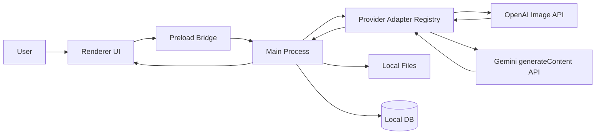

# CrossGen 技术架构

## 1. 技术栈建议

- 桌面壳：Electron
- 前端：React + TypeScript + Vite
- 状态管理：React 本地状态 + 轻量 hooks，MVP 不引入全局状态库
- 本地存储：JSON 文件优先，后续数据量增长再迁移 SQLite
- 文件处理：Node.js 原生文件系统 + 预加载桥接

## 2. 总体结构



## 3. 分层职责

### Renderer

- 呈现工作台
- 管理 provider selector、启动模型按钮、prompt、模型参数、历史列表
- 管理拖拽上传、画布交互、缩略图展示
- 不直接持有明文 API Key

### Preload

- 暴露安全 IPC
- 提供读取配置、保存配置、下载文件、打开目录等能力

### Main Process

- 负责读取/保存 provider config、触发模型探测并分发到 provider adapter
- 负责调用 OpenAI Image API 或 Gemini generateContent API
- 负责文件读写和下载
- 负责本地加密存储
- 负责错误归类与统一日志

## 4. Provider Adapter 架构

当前 main 已把运行时调用收敛到 provider adapter 层：

```text
src/main/services/imageProviderAdapter.ts
src/main/services/imageProviderAdapters.ts
src/main/services/openaiImageAdapter.ts
src/main/services/geminiImageAdapter.ts
src/main/services/generalImageAdapter.ts
src/main/services/modelDiscovery.ts
src/shared/modelCatalog.ts
src/shared/validation.ts
```

`ImageProviderAdapter` 的职责：

- `discoverModels`: 根据当前 provider config 和 API Key 拉取可用模型。
- `testConnection`: 测试 Key、Base URL 和模型发现路径。
- `validateJob`: 对当前 provider/launch 的运行请求做运行时校验。
- `runJob`: 把标准化后的 `GenerationJob` 转换为 provider API 请求，解析结果并保存为本地 `ImageAsset`。

Provider registry：

- `openaiImageAdapter` 负责 `providerKind: "openai"`。
- `geminiImageAdapter` 负责 `providerKind: "gemini"`。
- `generalImageAdapter` 只在 `launchId: "general"` 时作为包装层参与运行。Gemini General 使用 `generateContent` 参考图兜底；OpenAI / Custom General 使用最小 OpenAI-compatible `/images/generations` prompt-only 契约。

`custom` 当前只按 OpenAI-compatible 图片 provider 处理，只有 General prompt-only 生成路径可运行；它不是完整自定义 provider SDK。General 不承诺 mask、streaming、format、moderation、thinking、search grounding 或参考图能力的跨 provider 等价支持。

## 5. 模型目录与发现策略

本地模型目录位于 `src/shared/modelCatalog.ts`：

| Launch | Provider | Model | 当前能力边界 |
| --- | --- | --- | --- |
| GPT Image 2 | OpenAI | `gpt-image-2` | 生成、编辑、exact-mask inpaint、streaming partials、OpenAI 输出格式参数 |
| Nano Banana 3 | Gemini | `gemini-3.1-flash-image` | 生成、参考图编辑、guided-region editing、Gemini aspect ratio/resolution/Thinking/Search grounding |
| General | Gemini / OpenAI / Custom fallback | 探测到的非重点 image model | Gemini prompt/reference flow；OpenAI / Custom prompt-only OpenAI-compatible flow；不承诺 mask、streaming 或高级参数 |

模型发现路径：

- OpenAI / custom-compatible provider 使用 `GET {baseURL}/models` 和 `Authorization: Bearer ...`。
- Gemini 使用 `GET {baseURL}/models?key=...`。
- 发现错误通过 `sanitizeModelDiscoveryError` 脱敏，覆盖 OpenAI `sk-...`、Gemini `AIza...`、query `key=` 和 Bearer token 形态。
- 启动模型按钮状态来自 provider 是否保存 Key、模型发现是否运行、远端模型列表是否包含本地 catalog 目标模型，以及当前 adapter 是否已接入运行时。

## 6. OpenAI / GPT Image 2 集成策略

### MVP 采用 Image API

- 文生图：`/v1/images/generations`
- 图像编辑：`/v1/images/edits`
- 生成和编辑都支持非流式与流式请求
- 流式事件：
  - 生成：`image_generation.partial_image`、`image_generation.completed`
  - 编辑：`image_edit.partial_image`、`image_edit.completed`

原因：
- 语义简单
- 请求路径清晰
- 适合单次生成 / 编辑的工具式体验

### 后续增强

- Responses API 的 `image_generation` tool
- 支持 `action: auto | generate | edit`
- 支持多轮迭代式编辑

## 7. Gemini / Nano Banana 3 集成策略

Nano Banana 3 当前映射为 Gemini `gemini-3.1-flash-image`，通过 `src/main/services/geminiImageAdapter.ts` 调用：

```text
POST {baseURL}/models/{model}:generateContent
x-goog-api-key: <Gemini API key>
```

请求结构：

- prompt 放入 `contents[].parts[].text`。
- 参考图和局部引导 mask 作为 `contents[].parts[].inlineData` 传入。
- `generationConfig.responseModalities` 请求 `TEXT` 和 `IMAGE`。
- 分辨率和画面比例由 `generationConfig.responseFormat.image` 转换。
- 关闭 Thinking 时写入 `thinkingConfig.thinkingBudget = 0`。
- 开启 Search grounding 时写入 `tools: [{ googleSearch: {} }]`。

响应解析：

- `candidates[].content.parts[].inlineData` 保存为本地 image output。
- text parts 保存到 `providerMetadata.geminiTextParts`。
- `usageMetadata` 转换为通用 token usage 字段。

重要边界：

- Gemini 路径没有 OpenAI Image API 等价的独立 multipart `mask` 参数。
- UI 文案使用“局部引导编辑 / guided-region editing”，不承诺 exact-mask inpaint。
- 当前没有 streaming partial image 支持。

## 8. 关键能力映射

| 用户能力 | OpenAI 能力 | UI 入口 |
| --- | --- | --- |
| 文生图 | image generations | Prompt + 生成按钮 |
| 图生图 | image edits | 参考图上传 + 编辑按钮 |
| 局部重绘 | image edits + mask | 画布遮罩工具 |
| 质量控制 | size / quality | 高级参数 |
| 导出 | output format / compression | 下载菜单 |
| 快速反馈 | stream / partial images | 流式预览开关 |
| 内容过滤 | moderation | 高级参数 |

Gemini / Nano Banana 3:

| 用户能力 | Gemini 能力 | UI 入口 |
| --- | --- | --- |
| 文生图 | `generateContent` text prompt | Prompt + 运行按钮 |
| 参考图编辑 | `inlineData` image parts + text prompt | 参考图上传 + 编辑按钮 |
| 局部引导编辑 | 源图 + mask/overlay 作为 `inlineData` guidance | 局部重绘入口，文案说明非 exact mask |
| 画幅控制 | aspect ratio / image size config | Nano Banana 3 参数 |
| 文字结果 | response text parts | 保存到 job metadata |

## 9. 参数默认值建议

- model: `gpt-image-2`
- size: `auto`
- quality: `auto`
- format: `png`
- background: `auto`
- n: `1`
- stream: `true`
- partial_images: `2`
- moderation: `auto`
- timeout: `180000` 到 `300000` 毫秒

### gpt-image-2 参数约束

- `size`: `auto` 或 `WIDTHxHEIGHT`
- 自定义尺寸宽高必须都是 16 的倍数
- 最长边不超过 `3840px`
- 长短边比例不超过 `3:1`
- 总像素不少于 `655360`，不超过 `8294400`
- `quality`: `auto` / `low` / `medium` / `high`
- `output_format`: `png` / `jpeg` / `webp`
- `output_compression`: 仅在 `jpeg` / `webp` 生效，范围 `0..100`
- `background`: `auto` / `opaque`；不暴露 `transparent`
- `partial_images`: `0..3`
- `partial_images`: 开启流式局部图会产生额外 image output token 成本
- 编辑输入/参考图最多 16 张；使用 mask 时 mask 只应用到第一张输入图
- `input_fidelity`: 不对 `gpt-image-2` 暴露，模型自动高保真处理输入图

### Gemini / Nano Banana 3 参数约束

- model: `gemini-3.1-flash-image`
- aspectRatio: `1:1` / `3:4` / `4:3` / `9:16` / `16:9` / `21:9`
- resolution: `0.5K` / `1K` / `2K` / `4K`
- outputCount: 当前固定为 `1`
- thinking: boolean
- searchGrounding: boolean
- timeout: `30000` 到 `600000` 毫秒
- 输入图片支持 PNG / JPEG / WebP inline data

### General 参数约束

- providerKind 当前可为 `gemini`、`openai` 或 `custom`
- launchId: `general`
- model: 真实探测到的非重点图片模型 ID
- outputCount: 当前固定为 `1`
- timeout: `30000` 到 `600000` 毫秒
- Gemini General 支持 prompt 和参考图
- OpenAI / Custom General 只发送 `{ model, prompt, n: 1 }` 到 OpenAI-compatible `/images/generations`
- 不暴露 mask、streaming、format、compression、moderation、thinking、search grounding 等未适配能力

## 10. 数据模型

### ProviderConfig

- `id`
- `kind`
- `name`
- `apiKeySaved`
- `apiKeyPreview`
- `baseURL`
- `enabled`
- `defaultModel`
- `defaultSize`
- `defaultQuality`
- `timeoutMs`
- `discoveredModels`
- `lastModelDiscoveryAt`
- `lastModelDiscoveryError`
- `activeLaunchId`
- `activeModelId`
- `updatedAt`

### GenerationJob

- `id`
- `providerKind`
- `providerId`
- `launchId`
- `modelId`
- `modelDisplayName`
- `mode` (`generate` / `edit` / `inpaint`)
- `prompt`
- `inputAssets`
- `params`
- `status`
- `durationMs`
- `error`
- `createdAt`
- `updatedAt`
- `usage`
- `providerMetadata`

### ImageAsset

- `id`
- `jobId`
- `path`
- `thumbPath`
- `mimeType`
- `width`
- `height`
- `sourceType`

## 8. 文件结构建议

```text
src/
  main/
    services/
      openaiImageAdapter.ts
      geminiImageAdapter.ts
      generalImageAdapter.ts
      imageProviderAdapter.ts
      imageProviderAdapters.ts
      modelDiscovery.ts
      storage/
      download/
      log/
    ipc/
  preload/
  renderer/
    app/
    components/
    features/
      settings/
      generator/
      editor/
      history/
  shared/
    types.ts
    validation.ts
    modelCatalog.ts
```

## 12. 错误处理策略

- 无效 Key：立即测试并提示
- 超时：显示可调整的超时建议
- 模型不支持：引导切换参数
- 编辑素材不合规：提示尺寸或 mask 问题
- 网络中断：保留草稿和本地历史
- OpenAI adapter 脱敏 `sk-...` 形态错误
- Gemini adapter / model discovery 脱敏 `AIza...`、query `key=` 和 `x-goog-api-key` 相关错误片段
- General 不支持 provider 时提示当前 provider/model 未接入运行时

## 13. 安全策略

- API Key 只存本地
- 前端不打印 Key
- 错误日志脱敏
- Main process 对配置、任务、草稿、下载、打开目录、删除等 IPC payload 做运行时校验后再访问文件或状态
- 下载文件由 main process 统一落盘
- 可选支持系统钥匙串 / Keychain

## 14. 性能策略

- 生成时展示局部预览
- 历史缩略图单独缓存
- 大图预览使用懒加载
- 任务列表分页或虚拟滚动

## 15. 未来扩展点

- 预设模板
- 批量生成
- 任务队列
- 多 provider 切换
- Responses API 会话式编辑
- General 扩展到更多 provider SDK 的能力映射与安全降级
