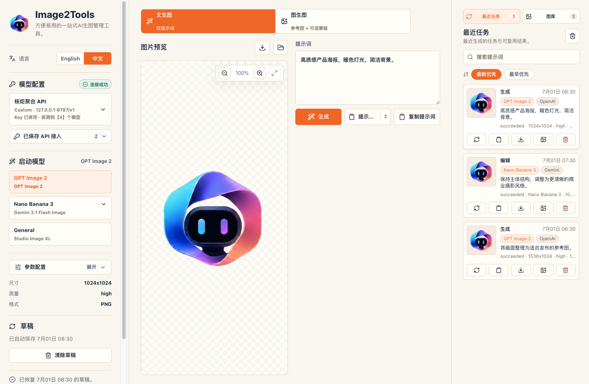
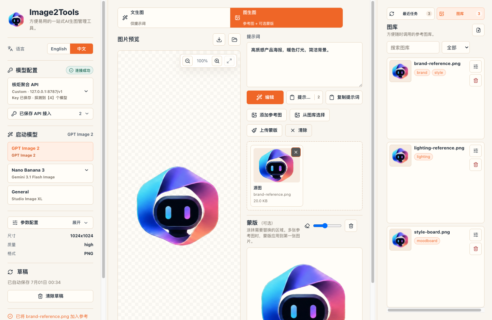
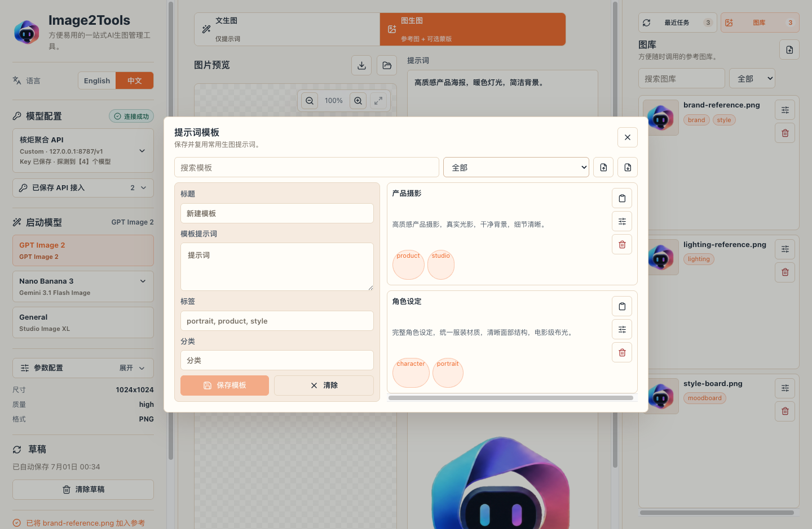
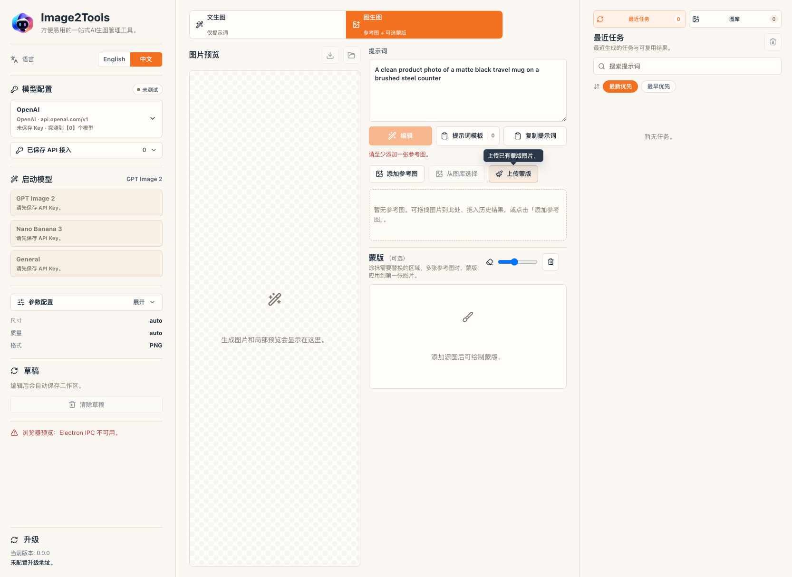

<h1 align="center">Image2Tools</h1>

<p align="center">
  
</p>

<p align="center">
  A local-first desktop workspace for AI image generation, editing, API access management, prompt reuse, reference images, and generation history.
</p>

<p align="center">
  <a href="https://github.com/Bliveren/image2tools/releases"></a>
  <a href="https://github.com/Bliveren/image2tools/actions/workflows/ci.yml"></a>
  <a href="./LICENSE"></a>
  
  
</p>

<p align="center">
  <b>English</b> · <a href="./README.zh-CN.md">简体中文</a>
</p>

<p align="center">
  <a href="#what-is-image2tools">Overview</a> ·
  <a href="#product-tour">Product Tour</a> ·
  <a href="#features">Features</a> ·
  <a href="#download-and-install">Download</a> ·
  <a href="#development">Development</a> ·
  <a href="#about-nowo-and-corgnitor">Nowo & Corgnitor</a>
</p>

## What Is Image2Tools

Image2Tools is an easy-to-use desktop tool for managing AI image generation and editing workflows. It currently focuses on GPT Image 2, Gemini-backed image models such as Nano Banana 3, and OpenAI-compatible custom image providers.


Version `0.2.3` turns the app into a cleaner production workspace:

- Multiple API access profiles are managed inside the model configuration module.
- The active API access is shown as one compact configuration card with provider name, Base URL, saved-key status, and discovered-model count.
- Saved but inactive API access profiles stay collapsed and can be expanded or switched at any time.
- Prompt templates are moved into a focused modal opened from the prompt area.
- The reference Gallery now lives in the right rail next to Recent jobs, so history results and saved references can both be dragged into the reference area.
- Image-to-image mode has clearer reference and mask drop zones, including tooltips for ambiguous controls.
- The interface uses a unified visual system with the `#F37021` accent reserved for important actions and active states.

Image2Tools is for creators, operators, product teams, and internal AI workflow builders who want a local desktop app instead of a hosted image workspace or account-based cloud product.

## Product Tour

The screenshots below show the current `0.2.3` workspace.

<table>
<tr>
<td width="50%" valign="top">

<br />
<sub><b>Text to image workspace.</b> Configure the active API access, launch a model, write a prompt, and generate from a compact central workspace.</sub>
</td>
<td width="50%" valign="top">

<br />
<sub><b>Image to image.</b> Add reference images, drag saved Gallery items or history outputs, and use mask controls for local edits where the selected model supports them.</sub>
</td>
</tr>
<tr>
<td width="50%" valign="top">

<br />
<sub><b>Prompt templates.</b> Save reusable prompt templates in a dedicated modal instead of occupying the main generation surface.</sub>
</td>
<td width="50%" valign="top">

<br />
<sub><b>Recent jobs and Gallery.</b> Keep generated results and reusable references together in the right rail for fast reuse.</sub>
</td>
</tr>
</table>

## Features

| Area | Capability |
| --- | --- |
| API access profiles | Save and switch OpenAI, Gemini, and OpenAI-compatible custom API access profiles. Each profile keeps its own name, Base URL, saved-key status, launch model, and model discovery result. |
| Model configuration | The active API access is presented as a compact card. Expand it when you need to edit API Key, Base URL, provider type, or discovery settings. |
| Model discovery | Detects available models from the configured API and shows discovered-model counts and actionable failure messages. |
| Launch models | GPT Image 2, Nano Banana 3, and General launch entries are enabled or disabled based on provider support, saved key status, and discovery results. |
| GPT Image 2 | Text-to-image, reference editing, multi-image editing, exact-mask inpainting, and validated OpenAI Image API parameters. OpenAI streaming is currently disabled globally for broad aggregator compatibility. |
| Nano Banana 3 | Gemini `generateContent` image generation, reference-image editing, guided-region editing, aspect ratio, resolution, Thinking, and Search grounding controls. |
| General mode | A minimal fallback for discovered image-capable models. Gemini supports prompt and reference-image flows; OpenAI and Custom use a prompt-only OpenAI-compatible generation contract. |
| Prompt templates | A single button under the prompt opens a template manager for saving, searching, tagging, importing, exporting, and applying reusable prompts. |
| Prompt chips | Gallery and template triggers can be inserted into the prompt flow, then serialized into model-ready prompt and reference inputs. |
| Reference Gallery | A right-rail Gallery stores reusable reference images. Items can be clicked or dragged into the reference area. |
| Recent jobs | History cards show provider/model context, prompt summaries, reusable outputs, download actions, and Gallery import actions. |
| Mask workflow | Image-to-image mode provides a clearer mask area, brush-size control, upload-mask action, and hover tooltips for ambiguous controls. |
| Local storage | Outputs, history, drafts, templates, and Gallery assets are stored locally under Electron user data. |
| Bilingual app UI | English and Simplified Chinese are available in the app and persisted locally. |
| Update checks | The app checks platform-specific update metadata and verifies downloaded asset size and SHA-256 before opening installers. |

## Download and Install

Download the latest installer from the [GitHub Releases page](https://github.com/Bliveren/image2tools/releases/latest).

| Platform | Artifact | Status |
| --- | --- | --- |
| macOS Apple Silicon | `Image2Tools-0.2.3-mac-arm64.dmg` | Developer ID signed when the local signing identity is available. Notarization depends on Apple notary credentials. |
| Windows x64 | `Image2Tools-Setup.exe` | NSIS installer. Native Windows validation is tracked in release evidence. |
| Linux x64 | `Image2Tools-0.2.3-linux-x86_64.AppImage` | Packaging support exists; publish status depends on the release cycle. |

Verify downloads against [`docs/updates/latest.json`](./docs/updates/latest.json):

```bash
# macOS
shasum -a 256 ~/Downloads/Image2Tools-0.2.3-mac-arm64.dmg

# Windows PowerShell
Get-FileHash .\Image2Tools-Setup.exe -Algorithm SHA256
```

If macOS Gatekeeper blocks an unnotarized local build, right-click the app and choose **Open**, or clear the quarantine attribute:

```bash
xattr -dr com.apple.quarantine /Applications/Image2Tools.app
```

If Windows SmartScreen appears, choose **More info** and then **Run anyway**.

## Product Flow

1. Add or expand an API access profile in Model config.
2. Save the API Key and Base URL, then run model discovery.
3. Launch GPT Image 2, Nano Banana 3, or General based on discovered capability.
4. Enter a prompt, optionally apply a prompt template, and generate.
5. For image-to-image work, add references from disk, Gallery, or Recent jobs.
6. When supported, upload or paint a mask for local edits.
7. Reuse history, import useful outputs into Gallery, or download results.

## Development

Requirements:

- Node.js 20+
- pnpm 10+
- macOS, Windows, or Linux
- OpenAI or Gemini API access for real image generation

```bash
pnpm install
pnpm dev:electron
```

Build and test:

```bash
pnpm build
pnpm verify:mock-api
pnpm verify:mock-gemini-api
pnpm verify:mock-model-discovery
```

Packaging:

```bash
pnpm package:dir
pnpm package:mac
pnpm package:win
pnpm verify:release:mac
pnpm verify:release:windows
pnpm verify:release:linux
pnpm verify:release-evidence
```

`pnpm build` runs TypeScript checks, Vitest, the renderer build, and the Electron main build. Mock verifiers cover OpenAI image calls, Gemini `generateContent`, model discovery, and provider-specific error handling without spending real API credits.

For a Developer ID signed local macOS build without notarization, use the configured signing identity directly:

```bash
PATH="$PWD/node_modules/.bin:$PATH" node scripts/electron-builder-pnpm.mjs --mac \
  -c.mac.notarize=false \
  -c.mac.identity="Xiamen Corgnitor Technology Co.,Ltd (RPX587R2R7)"
```

Use `pnpm package:mac:signed` only when the full Apple notarization environment is configured:

- `CSC_NAME`
- `APPLE_ID`
- `APPLE_APP_SPECIFIC_PASSWORD`
- `APPLE_TEAM_ID`

## Mock API

Use mock servers when you want to test the app without real API spending.

```bash
pnpm mock:openai
```

Configure Image2Tools:

```text
API Key: sk-mock-image2tools
Base URL: http://127.0.0.1:8787/v1
```

```bash
pnpm mock:gemini
```

Configure Image2Tools:

```text
Provider: Gemini
API Key: mock-gemini-key
Base URL: http://127.0.0.1:8788/v1beta
```

## Release Evidence

External gates are recorded in [`docs/release/evidence.json`](./docs/release/evidence.json). The ledger covers real provider API acceptance, signed macOS packaging, native Windows/Linux validation, and update-manifest assets.

```bash
pnpm verify:release-evidence
pnpm verify:release-evidence -- --require-complete
```

Release artifacts and update metadata should be refreshed from the exact package being published.

## About Nowo and Corgnitor

Image2Tools is provided by [Nowo](https://www.nowo.com/) and [Corgnitor](https://www.corgnitor.com/).

[Nowo](https://www.nowo.com/), known in Chinese as 诺惟, focuses on AI-native product design, product strategy, and applied software workflows. Its work centers on turning AI capabilities into usable products, workflows, and user-facing experiences.

[Corgnitor](https://www.corgnitor.com/), known in Chinese as 核炬科技, focuses on AI engineering implementation and productization. It helps turn model capabilities, automation systems, and internal tools into maintainable software products.

Together, Nowo and Corgnitor maintain Image2Tools as a practical open-source desktop utility for image-generation workflows.

## License

Image2Tools is released under the [MIT License](./LICENSE).
