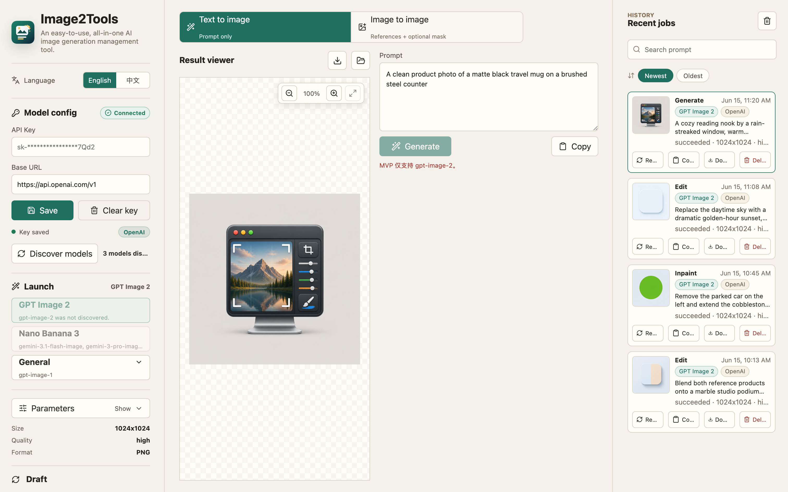
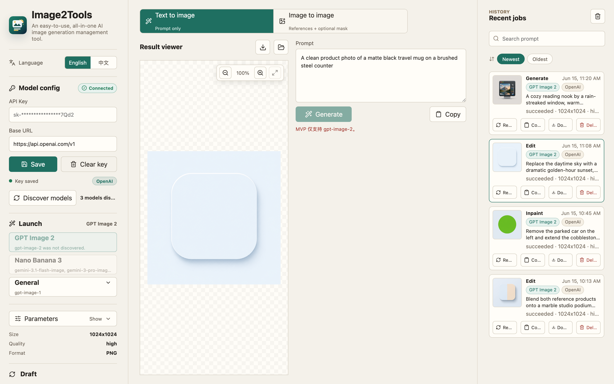

<div align="right">
  <details>
    <summary>Language</summary>
    <div align="right">
      <p><a href="#english">English</a></p>
      <p><a href="#simplified-chinese">简体中文</a></p>
    </div>
  </details>
</div>

<a id="english"></a>

<h1 align="center">
  
  <br />
  Image2Tools
</h1>

<p align="center">
  An easy-to-use, all-in-one AI image generation management tool for GPT Image 2, Gemini-backed Nano Banana 3, and compatible image providers.
</p>

<p align="center">
  <a href="https://github.com/Bliveren/image2tools/releases"></a>
  <a href="https://github.com/Bliveren/image2tools/actions/workflows/ci.yml"></a>
  <a href="https://github.com/Bliveren/image2tools/commits"></a>
  <a href="https://github.com/Bliveren/image2tools/stargazers"></a>
  <a href="./LICENSE"></a>
  
  
</p>

<p align="center">
  <a href="#features">Features</a> ·
  <a href="#showcase">Showcase</a> ·
  <a href="#download--install">Download</a> ·
  <a href="#open-source-status">Open Source Status</a> ·
  <a href="#development">Development</a> ·
  <a href="#about-the-sponsors">Sponsors</a> ·
  <a href="#simplified-chinese">简体中文</a>
</p>

## Showcase





## Download & Install

Download the latest installer from the [Releases page](https://github.com/Bliveren/image2tools/releases/latest).

| Platform | File | Notes |
| --- | --- | --- |
| macOS (Apple Silicon) | `Image2Tools-<version>-mac-arm64.dmg` | Developer ID signed and Apple-notarized when published from the signed release pipeline |
| Windows (x64) | `Image2Tools-Setup.exe` | NSIS installer; SmartScreen reputation may still appear on early open-source builds |

If macOS or Windows shows a first-run security prompt, verify the SHA256 below and open the app through the system's normal confirmation flow. The source is public and each release artifact's SHA256 is published so the downloaded file can be checked against the built artifact.

**Verify the download (optional).** Compare the SHA256 of your downloaded file against the value published in [`docs/updates/latest.json`](./docs/updates/latest.json):

```bash
# macOS
shasum -a 256 ~/Downloads/Image2Tools-*-mac-arm64.dmg
# Windows (PowerShell)
Get-FileHash .\Image2Tools-Setup.exe -Algorithm SHA256
```

## What Is Image2Tools

Image2Tools is an easy-to-use, all-in-one desktop tool for AI image generation management. The current main branch supports GPT Image 2 through the OpenAI Image API, the app's Nano Banana 3 launch target through Gemini image models such as `gemini-3.1-flash-image` and `gemini-3-pro-image`, and a minimal General launch mode for discovered non-focused image models.

The app is built for non-developers, individual creators, product teams, and internal AI workflow builders who need a simple desktop tool instead of a cloud workspace or account system. The latest UI separates API access management, launch-model selection, model-specific parameters, prompt templates, a managed reference Gallery, local history, draft recovery, and update management so setup, model discovery, generation, reuse, and desktop updates stay in one local workflow.

## Features

| Area | Capability |
| --- | --- |
| Multi-API management | Save, switch, and delete multiple OpenAI, Gemini, and OpenAI-compatible Custom API access profiles without re-entering keys or model discovery results. |
| Model configuration | Per-API Base URL/API Key storage, saved key preview, automatic connection checks, and friendly failure hints. |
| Model discovery | Detects models exposed by the configured API and uses discovered provider/model metadata instead of relying only on the selected provider label. |
| Launch models | GPT Image 2, Nano Banana 3, and General launch buttons with availability reasons plus concrete discovered-model choices inside each launch button. |
| GPT Image 2 | Text-to-image, single/multi-image editing, exact-mask inpainting, streaming partial previews, and validated OpenAI Image API parameters. |
| Nano Banana 3 | Gemini `generateContent` image generation, reference-image editing, guided-region editing, aspect ratio, resolution, Thinking, and Search grounding controls. |
| General | Minimal fallback for discovered non-focused image models: Gemini supports prompt and reference images, while OpenAI and Custom use a prompt-only OpenAI-compatible generation contract. |
| Prompt templates | Local template library with search, tags, categories, edit/delete, and JSON import/export. |
| Reference Gallery | Managed local reference-image library with import, tagging, search, history-to-Gallery reuse, and filename-only safe previews. |
| Prompt chips | `@` inserts a Gallery reference, `~` expands a template, and `#` adds a color value while the backend still receives plain text plus input assets. |
| Local history | Generated assets are saved in Electron user data with provider/model chips and can be reused, opened, downloaded, or cleared after explicit confirmation. |
| Workspace recovery | Draft prompt, parameters, references, masks, and brush size are autosaved. |
| Bilingual UI | In-app language switch supports English and Simplified Chinese through localStorage. |
| Updates | Startup update checks, clear up-to-date status, manifest-based platform matching, draft preservation before update, and Windows silent update/restart flow. |
| Safety | Managed asset protocol prevents arbitrary local file exposure from previews. |

## Product Flow

1. Add one or more API access profiles with provider type, Base URL, and API Key. The app automatically tests the active profile on startup and after config changes.
2. Run model discovery for each profile and switch between profiles when you need a different key, endpoint, or model inventory.
3. Pick GPT Image 2, Nano Banana 3, or General from the launch-model area. If multiple compatible concrete models are discovered under a launch family, open the launch button menu and choose the exact model to run.
4. Compose the prompt with plain text, saved templates, managed Gallery references, and color chips.
5. Choose Generate, Edit, or Inpaint/Guided Region where the selected model supports it, then tune model-specific parameters.
6. Download results, open the local output folder, save outputs back into the Gallery, or reuse history prompts with their provider/model context.

## Multi-API Management

Image2Tools can keep several API access profiles side by side. Each profile has its own provider type, Base URL, saved-key state, discovered model list, connection status, and selected concrete model. Switching profiles updates the model configuration, launch model, and parameter areas without requiring the user to paste keys again.

Model availability is based on what the active API actually exposes. For example, an OpenAI-compatible aggregator key can enable both GPT Image 2 and Nano Banana 3 if discovery returns compatible models for both launch families.

## Prompt Workflow

The prompt workflow is local-first. Templates store reusable prompt text with tags and optional categories. The Gallery copies imported references into the app-managed user data directory and only exposes filename-based preview URLs, so the renderer never needs arbitrary local file paths.

Prompt chips keep composition fast without changing provider contracts. `@` adds a Gallery reference to `inputAssets`, `~` expands a saved template into the final prompt, and `#` inserts a color value. Before a job starts, the composer serializes everything to the existing backend shape: plain text `prompt`, `inputAssets`, and model params.

## Open Source Status


Image2Tools is suitable to publish as an MIT-licensed open-source project based on the current repository audit:

| Check | Result |
| --- | --- |
| Project license | `LICENSE` contains the MIT license and `package.json` declares `MIT`. |
| Runtime dependencies | Production dependencies report MIT or ISC licenses. |
| Development dependencies | Development tooling licenses are permissive/common for build and test tooling; no copyleft runtime blocker was found. |
| Secrets | The current scan found test/mock keys, environment variable names, and expected Authorization code paths, but no real API key or certificate committed to tracked source. |
| Generated and local files | `.gitignore` excludes `node_modules/`, build output, release output, real API artifacts, logs, and env files. |
| Remaining release gates | Re-run the secret scan before publishing, and verify signed/notarized macOS builds plus native Windows/Linux packages before distributing binaries. |

This is an engineering readiness assessment, not legal advice. If the project will be published by a legal entity, run the final license and trademark review under that entity's normal process.

## Development

Requirements:

- Node.js and pnpm
- macOS, Windows, or Linux
- OpenAI or Gemini API access for real image generation

```bash
pnpm install
pnpm dev:electron
```

Build and test:

```bash
pnpm build
pnpm verify:mock-api
pnpm verify:mock-gemini-api
pnpm verify:mock-model-discovery
```

Packaging:

```bash
pnpm package:dir
pnpm package:mac
pnpm package:win
pnpm verify:release:mac
pnpm verify:release:windows
pnpm verify:release:linux
pnpm verify:release-evidence
```

`pnpm build` runs type checks, Vitest, the renderer build, and the Electron main build. `pnpm verify:mock-api` exercises the mock OpenAI Image API path. `pnpm verify:mock-gemini-api` exercises Gemini `generateContent`, guided-region requests, request recording, and Gemini-style error paths. `pnpm verify:mock-model-discovery` checks OpenAI/Gemini discovery fixtures, missing focused-model cases, General Gemini candidate detection, and Gemini discovery auth errors. `pnpm package:dir` creates an unpacked app for local inspection. `pnpm package:mac` creates local ad-hoc macOS packages; use `pnpm package:mac:signed` only when Developer ID and notarization environment variables are configured.

`pnpm verify:release:windows` defaults to full native Windows verification, including the NSIS silent install, installed-app launch, and silent uninstall cycle. Hosted GitHub workflows use `IMAGE2TOOLS_WINDOWS_VERIFY_MODE=package-smoke` to keep installer PE checks and unpacked-app launch smoke coverage without depending on the hosted runner's installer policy.

`pnpm verify:release-evidence` validates the external-gate ledger in [`docs/release/evidence.json`](./docs/release/evidence.json). Use `pnpm verify:release-evidence -- --require-complete` before publishing to require every real API, signing, native platform, and update-manifest gate to have passed evidence.

## Mock API

Use the mock servers when you do not want to spend real API credits.

```bash
pnpm mock:openai
```

Then configure the app with:

```text
API Key: sk-mock-image2tools
Base URL: http://127.0.0.1:8787/v1
```

The OpenAI mock supports `/models`, `/images/generations`, and `/images/edits`. It returns valid PNG base64 data and streaming events, so it can verify local configuration, request handling, previews, saving, downloads, and history. It does not represent real GPT Image 2 quality.

```bash
pnpm mock:gemini
```

Then configure the app with:

```text
Provider: Gemini
API Key: mock-gemini-key
Base URL: http://127.0.0.1:8788/v1beta
```

The Gemini mock supports `/models`, `:generateContent`, request recording, and Gemini-style error responses. It returns deterministic PNG image parts and text parts for Nano Banana 3 text-to-image, reference editing, and guided-region requests. It does not represent real Gemini image quality.

Automated mock verification:

```bash
pnpm verify:mock-api
pnpm verify:mock-gemini-api
pnpm verify:mock-model-discovery
```

## Real API Acceptance

`pnpm verify:real-api` is intentionally cost-gated and covers the OpenAI GPT Image 2 path. It only sends real image requests when an API key is present and cost acceptance is explicit:

```bash
IMAGE2TOOLS_API_KEY=sk-... IMAGE2TOOLS_REAL_API_ACCEPT_COST=1 pnpm verify:real-api
```

Streaming acceptance requires an additional opt-in:

```bash
IMAGE2TOOLS_REAL_API_ACCEPT_STREAM_COST=1
```

Generated acceptance artifacts are written to `real-api-artifacts/`, which is ignored by git.

`pnpm verify:real-gemini-api` is also cost-gated and covers Gemini / Nano Banana 3 discovery, text-to-image generation, reference editing, and guided-region editing:

```bash
IMAGE2TOOLS_GEMINI_API_KEY=... IMAGE2TOOLS_REAL_GEMINI_API_ACCEPT_COST=1 pnpm verify:real-gemini-api
```

Gemini / Nano Banana 3 real API acceptance still needs the app-level history and download checks documented in [EXTERNAL_ACCEPTANCE.md](./EXTERNAL_ACCEPTANCE.md) before it can be marked complete.

Record real API, signing, native platform, and formal update-manifest evidence in [`docs/release/evidence.json`](./docs/release/evidence.json). The ledger must stay redacted and pass `pnpm verify:release-evidence` before checklist items are marked complete.

## Icon

The app icon is generated from the local project source at [`build/icon.svg`](./build/icon.svg). Derived packaging assets are kept in:

- [`build/icon.png`](./build/icon.png)
- [`build/icon.icns`](./build/icon.icns)
- [`build/icon.ico`](./build/icon.ico)
- [`build/icon.iconset/`](./build/icon.iconset)
- [`public/favicon.svg`](./public/favicon.svg)

The mark combines an image canvas, edit wand, and streaming/output lines to match the product's `gpt-image-2` workflow.

## Documentation

- [PLAN.md](./PLAN.md): roadmap, scope, and phase goals
- [MULTI_MODEL_PLAN.md](./MULTI_MODEL_PLAN.md): multi image-model architecture and rollout plan
- [MULTI_MODEL_TODO.md](./MULTI_MODEL_TODO.md): executable task list for GPT Image 2, Nano Banana 3, and General support
- [MULTI_MODEL_CHECKLIST.md](./MULTI_MODEL_CHECKLIST.md): acceptance checklist for multi-model support
- [RELEASE_NOTES.md](./RELEASE_NOTES.md): draft `v0.2.0` release notes and release gates
- [ARCHITECTURE.md](./ARCHITECTURE.md): architecture, data flow, and module split
- [TODO.md](./TODO.md): executable task list
- [CHECKLIST.md](./CHECKLIST.md): development and release checklist
- [COMPLETION_AUDIT.md](./COMPLETION_AUDIT.md): delivery evidence and validation commands
- [EXTERNAL_ACCEPTANCE.md](./EXTERNAL_ACCEPTANCE.md): real API, signing, notarization, and platform acceptance
- [SECURITY.md](./SECURITY.md): security and pre-publication checks
- [OPEN_SOURCE_AUDIT.md](./OPEN_SOURCE_AUDIT.md): MIT open-source readiness audit

## Security Checks Before Publishing

Run these before making the repository public or publishing a release:

```bash
pnpm build
pnpm verify:mock-api
pnpm verify:mock-gemini-api
pnpm verify:mock-model-discovery
rg -n "sk-[A-Za-z0-9_-]{8,}|AIza[A-Za-z0-9_-]{8,}|Bearer |Authorization|x-goog-api-key|apiKey|encryptedApiKey|secret|password|token|private|/Users/|[A-Za-z0-9._%+-]+@[A-Za-z0-9.-]+\\.[A-Za-z]{2,}|github\\.com/.+/milestone|release/tag|origin/archive" \
  -g '!node_modules' -g '!dist*' -g '!release' -g '!pnpm-lock.yaml'
find . -maxdepth 3 \( -name '.env*' -o -name '*.pem' -o -name '*.p12' -o -name '*.key' -o -name '*state*.json' -o -name '*secret*' \) \
  -not -path './node_modules/*' -print
git ls-files | rg '(^|/)(dist|dist-renderer|release|real-api-artifacts|node_modules)/|\.env|\.pem|\.p12|state\.json|\.DS_Store' || true
```

Expected hits include mock keys, test fixtures, environment variable names, Authorization or `x-goog-api-key` request code, and documentation that describes security checks. Real OpenAI keys, real Gemini keys, signing certificates, private release links, local state files, and personal paths should not appear.

## About The Sponsors

Image2Tools is provided by Nowo and Corgnitor.

Nowo, known in Chinese as 诺惟, focuses on AI-native product design and applied software workflows. Corgnitor, known in Chinese as 核炬科技, focuses on engineering implementation and productization of AI-enabled tools. Together they provide Image2Tools as a practical open-source desktop utility for image-generation workflows.

## License

Image2Tools is released under the [MIT License](./LICENSE).

---

<a id="simplified-chinese"></a>

# Image2Tools 简体中文

<p align="center">
  
</p>

<p align="center">
  方便易用的一站式AI生图管理工具，支持 GPT Image 2、Gemini 支撑的 Nano Banana 3，以及兼容图片模型服务。
</p>

<p align="center">
  <a href="#english">English</a> ·
  <a href="#功能亮点">功能亮点</a> ·
  <a href="#项目展示">项目展示</a> ·
  <a href="#下载安装">下载安装</a> ·
  <a href="#mit-开源状态">MIT 开源状态</a> ·
  <a href="#开发运行">开发运行</a> ·
  <a href="#背后的企业">背后的企业</a>
</p>

## 项目展示


## 下载安装

从 [Releases 页面](https://github.com/Bliveren/image2tools/releases/latest) 下载最新安装包。

| 平台 | 文件 | 说明 |
| --- | --- | --- |
| macOS（Apple 芯片） | `Image2Tools-<版本>-mac-arm64.dmg` | 通过签名发布流水线产出时为 Developer ID 签名并完成 Apple 公证 |
| Windows（x64） | `Image2Tools-Setup.exe` | NSIS 安装程序；早期开源版本仍可能出现 SmartScreen 声誉提示 |

如果 macOS 或 Windows 首次运行时出现系统安全确认，请先按下方 SHA256 校验下载文件，再通过系统提供的正常确认流程打开。项目源码公开可审计，每个发布安装包都会附带 SHA256，便于确认下载文件与构建产物一致。

**校验下载（可选）。** 将下载文件的 SHA256 与 [`docs/updates/latest.json`](./docs/updates/latest.json) 中发布的值比对：

```bash
# macOS
shasum -a 256 ~/Downloads/Image2Tools-*-mac-arm64.dmg
# Windows (PowerShell)
Get-FileHash .\Image2Tools-Setup.exe -Algorithm SHA256
```

## 项目定位

Image2Tools 是一个方便易用的一站式AI生图管理工具。当前 main 分支支持通过 OpenAI Image API 使用 GPT Image 2，通过 Gemini 图片模型（如 `gemini-3.1-flash-image` 和 `gemini-3-pro-image`）使用应用内的 Nano Banana 3 启动入口，并为应用探测到的非重点图片模型提供最小 General 兜底模式。

适合非开发人员、个人创作者、产品团队、AI 应用工程团队和需要轻量图像工作台的内部工具场景。最新版界面把 API 接入管理、启动模型选择、模型专属参数、提示词模板、受管参考图 Gallery、本地历史、草稿恢复和升级管理拆开，让配置、模型探测、生成、复用和桌面更新集中在一个本地工作流里完成。

## 功能亮点

| 模块 | 能力 |
| --- | --- |
| 多 API 管理 | 保存、切换和删除多个 OpenAI、Gemini 与 OpenAI 兼容 Custom API 接入，不需要反复输入 Key 或重新探测模型。 |
| 模型配置 | 每个 API 接入独立保存 Base URL/API Key、Key 脱敏预览、自动联通测试和友好的失败原因提示。 |
| 模型探测 | 基于用户配置的 API 探测可用模型，并使用探测到的 provider/model 信息匹配功能，而不是只依赖用户选择的服务商标签。 |
| 启动模型 | GPT Image 2、Nano Banana 3、General 启动按钮，根据探测结果显示可用性原因，并把具体可运行模型折叠到对应启动按钮内选择。 |
| GPT Image 2 | 文生图、单图/多图编辑、精确 mask 局部重绘、流式局部预览和 OpenAI Image API 参数校验。 |
| Nano Banana 3 | Gemini `generateContent` 图片生成、参考图编辑、引导式区域编辑、画面比例、分辨率、Thinking 和 Search grounding 控件。 |
| General | 针对探测到的非重点图片模型提供最小兜底；Gemini 支持 prompt 与参考图，OpenAI 和 Custom 使用 OpenAI 兼容的纯提示词生成契约。 |
| 提示词模板 | 本地模板库支持搜索、标签、分类、编辑删除和 JSON 导入导出。 |
| 参考图 Gallery | 受管本地参考图库，支持导入、打标签、搜索、历史结果加入 Gallery，并用文件名级安全预览。 |
| Prompt chips | `@` 插入 Gallery 参考图，`~` 展开模板，`#` 加入色值，同时后端仍接收纯文本 prompt 和 input assets。 |
| 本地历史 | 输出资产保存在 Electron user data，历史条目显示 provider/model，可下载、打开目录、复用 prompt；清空全部历史前需要二次确认。 |
| 草稿恢复 | 自动保存 prompt、参数、参考图、mask 和画笔大小。 |
| 双语界面 | 应用内支持 English / 简体中文切换，语言选择保存在 localStorage。 |
| 自动升级 | 启动时自动检查更新，明确提示已是最新版本；发现新版本时提供更新按钮，更新前保存草稿，Windows 支持静默安装后重启。 |
| 安全边界 | 使用受限的本地资源协议预览受管图片，避免任意文件暴露。 |

## 产品流程

1. 添加一个或多个 API 接入，配置服务商类型、Base URL 与 API Key。应用会在保存后和下次启动时自动测试当前接入的联通状态。
2. 对每个 API 接入执行模型探测，需要不同 Key、端点或模型库存时直接切换接入。
3. 在启动模型区选择 GPT Image 2、Nano Banana 3 或 General。如果某个启动模型下探测到多个具体模型，打开启动按钮内的下拉菜单，选择实际要运行的模型。
4. 使用纯文本、已保存模板、Gallery 参考图和色值 chip 组合 prompt。
5. 根据模型能力选择生成、编辑或局部重绘 / 引导式区域编辑，并调整模型专属参数。
6. 下载结果、打开本地输出目录、把结果加入 Gallery，或从历史记录复用带有 provider/model 上下文的 prompt。

## 多 API 管理

Image2Tools 可以同时保存多个 API 接入。每个接入都有独立的服务商类型、Base URL、Key 保存状态、模型探测结果、连接状态和具体模型选择。切换接入后，模型配置、启动模型和参数区会随之更新，不需要用户重新粘贴 Key。

模型功能是否可启动基于当前 API 实际探测到的模型决定。例如，同一个 OpenAI 兼容聚合站 Key 如果同时暴露 GPT Image 2 与 Gemini 图片模型，就可以同时启用 GPT Image 2 与 Nano Banana 3 启动入口。

## 提示词工作流

提示词工作流坚持本地优先。模板库保存可复用的 prompt 文本、标签和分类。Gallery 会把导入参考图复制到应用受管目录，并只通过文件名级预览 URL 暴露给 renderer，避免任意本地路径读取。

Prompt chips 用来提升组合效率，但不改变 provider 契约。`@` 会把 Gallery 参考图加入 `inputAssets`，`~` 会把模板展开进最终 prompt，`#` 会插入色值。任务启动前，composer 会统一序列化为现有后端结构：纯文本 `prompt`、`inputAssets` 和模型参数。

## MIT 开源状态


基于当前仓库审计，Image2Tools 可以作为 MIT 协议项目开源发布：

| 检查项 | 结论 |
| --- | --- |
| 项目许可证 | `LICENSE` 为 MIT 文本，`package.json` 声明 `MIT`。 |
| 运行时依赖 | 生产依赖许可证为 MIT 或 ISC。 |
| 开发依赖 | 构建和测试工具为常见宽松许可证，未发现运行时 copyleft 阻断项。 |
| 敏感信息 | 当前扫描只发现 mock key、测试数据、环境变量名和正常鉴权代码路径，未发现真实 API Key 或证书进入跟踪源码。 |
| 生成与本地文件 | `.gitignore` 已排除 `node_modules/`、构建产物、release 产物、真实 API 验收产物、日志和环境变量文件。 |
| 发布前剩余门禁 | 公开前应重新扫描敏感信息；分发二进制前应完成 macOS 签名/公证以及 Windows/Linux 原生验收。 |

以上是工程开源就绪判断，不构成法律意见。如果项目以公司主体发布，仍建议按公司流程进行最终许可证、商标和合规审查。

## 开发运行

环境要求：

- Node.js 与 pnpm
- macOS、Windows 或 Linux
- 如需真实生成图片，需要 OpenAI 或 Gemini API 访问权限

```bash
pnpm install
pnpm dev:electron
```

构建与测试：

```bash
pnpm build
pnpm verify:mock-api
pnpm verify:mock-gemini-api
pnpm verify:mock-model-discovery
```

打包：

```bash
pnpm package:dir
pnpm package:mac
pnpm package:win
pnpm verify:release:mac
pnpm verify:release:windows
pnpm verify:release:linux
pnpm verify:release-evidence
```

`pnpm build` 会执行类型检查、Vitest、renderer 构建和 Electron main 构建。`pnpm verify:mock-api` 覆盖 mock OpenAI Image API 链路。`pnpm verify:mock-gemini-api` 覆盖 Gemini `generateContent`、引导式区域请求、请求记录和 Gemini 风格错误路径。`pnpm verify:mock-model-discovery` 覆盖 OpenAI/Gemini 探测 fixture、缺少重点模型时的状态、General Gemini 候选模型识别和 Gemini 探测鉴权错误。`pnpm package:dir` 生成未压缩应用目录，适合本地检查。`pnpm package:mac` 生成本地 ad-hoc macOS 包；具备 Developer ID 和公证环境变量后再使用 `pnpm package:mac:signed`。

`pnpm verify:release:windows` 默认执行完整原生 Windows 验证，包括 NSIS 静默安装、已安装应用启动和静默卸载。Hosted GitHub workflow 使用 `IMAGE2TOOLS_WINDOWS_VERIFY_MODE=package-smoke` 保留安装包 PE 检查和未压缩应用启动烟测，同时避开托管 runner 的安装器策略差异。

`pnpm verify:release-evidence` 校验 [`docs/release/evidence.json`](./docs/release/evidence.json) 中的外部验收证据。发布前使用 `pnpm verify:release-evidence -- --require-complete` 强制要求真实 API、签名、原生平台和更新 manifest 证据全部通过。

## Mock API 验证

没有真实 API Key 或不希望产生费用时，可以使用 mock 服务。

```bash
pnpm mock:openai
```

应用中填写：

```text
API Key: sk-mock-image2tools
Base URL: http://127.0.0.1:8787/v1
```

OpenAI mock 支持 `/models`、`/images/generations`、`/images/edits`，并返回有效 PNG base64 与流式事件，可验证本地配置、请求、预览、保存、下载和历史链路。它不代表真实 GPT Image 2 输出质量。

```bash
pnpm mock:gemini
```

应用中填写：

```text
Provider: Gemini
API Key: mock-gemini-key
Base URL: http://127.0.0.1:8788/v1beta
```

Gemini mock 支持 `/models`、`:generateContent`、请求记录和 Gemini 风格错误响应。它会为 Nano Banana 3 文生图、参考图编辑和引导式区域请求返回确定性的 PNG image parts 与 text parts，但不代表真实 Gemini 图片质量。

自动化 mock 验证：

```bash
pnpm verify:mock-api
pnpm verify:mock-gemini-api
pnpm verify:mock-model-discovery
```

## 真实 API 验收

`pnpm verify:real-api` 默认不会产生真实图片请求，覆盖 OpenAI GPT Image 2 链路。必须设置 API Key 且显式确认成本后才会运行：

```bash
IMAGE2TOOLS_API_KEY=sk-... IMAGE2TOOLS_REAL_API_ACCEPT_COST=1 pnpm verify:real-api
```

流式验收需要额外确认：

```bash
IMAGE2TOOLS_REAL_API_ACCEPT_STREAM_COST=1
```

验收输出会写入被 git 忽略的 `real-api-artifacts/`。

`pnpm verify:real-gemini-api` 同样受成本确认保护，覆盖 Gemini / Nano Banana 3 模型探测、文生图、参考图编辑和局部引导编辑：

```bash
IMAGE2TOOLS_GEMINI_API_KEY=... IMAGE2TOOLS_REAL_GEMINI_API_ACCEPT_COST=1 pnpm verify:real-gemini-api
```

Gemini / Nano Banana 3 真实 API 验收仍需完成 [EXTERNAL_ACCEPTANCE.md](./EXTERNAL_ACCEPTANCE.md) 中的应用内历史与下载检查后，才能标记为完成。

真实 API、签名、原生平台和正式更新 manifest 证据统一记录在 [`docs/release/evidence.json`](./docs/release/evidence.json)。证据必须脱敏并通过 `pnpm verify:release-evidence` 后，才能把 checklist 项改为完成。

## 图标

应用图标由本地项目源文件 [`build/icon.svg`](./build/icon.svg) 生成，派生文件包括：

- [`build/icon.png`](./build/icon.png)
- [`build/icon.icns`](./build/icon.icns)
- [`build/icon.ico`](./build/icon.ico)
- [`build/icon.iconset/`](./build/icon.iconset)
- [`public/favicon.svg`](./public/favicon.svg)

图形融合了图片画布、编辑魔棒和输出线条，对应 Image2Tools 的 `gpt-image-2` 工作流。

## 文档索引

- [PLAN.md](./PLAN.md): 总体开发计划、阶段目标、范围边界
- [MULTI_MODEL_PLAN.md](./MULTI_MODEL_PLAN.md): 多生图模型架构与阶段推进计划
- [MULTI_MODEL_TODO.md](./MULTI_MODEL_TODO.md): GPT Image 2、Nano Banana 3、General 支持的可执行任务清单
- [MULTI_MODEL_CHECKLIST.md](./MULTI_MODEL_CHECKLIST.md): 多模型支持验收检查清单
- [RELEASE_NOTES.md](./RELEASE_NOTES.md): `v0.2.0` 发布说明草稿与发布门禁
- [ARCHITECTURE.md](./ARCHITECTURE.md): 技术架构、数据流、模块拆分
- [TODO.md](./TODO.md): 可直接执行的任务清单
- [CHECKLIST.md](./CHECKLIST.md): 开发与发布检查清单
- [COMPLETION_AUDIT.md](./COMPLETION_AUDIT.md): 当前交付证据、验证命令和外部待办
- [EXTERNAL_ACCEPTANCE.md](./EXTERNAL_ACCEPTANCE.md): 真实 API、签名、公证、跨平台和 CI 外部验收步骤
- [SECURITY.md](./SECURITY.md): 开源前安全与敏感信息检查
- [OPEN_SOURCE_AUDIT.md](./OPEN_SOURCE_AUDIT.md): MIT 开源就绪审计记录

## 公开前安全检查

发布公开仓库或 release 前建议执行：

```bash
pnpm build
pnpm verify:mock-api
pnpm verify:mock-gemini-api
pnpm verify:mock-model-discovery
rg -n "sk-[A-Za-z0-9_-]{8,}|AIza[A-Za-z0-9_-]{8,}|Bearer |Authorization|x-goog-api-key|apiKey|encryptedApiKey|secret|password|token|private|/Users/|[A-Za-z0-9._%+-]+@[A-Za-z0-9.-]+\\.[A-Za-z]{2,}|github\\.com/.+/milestone|release/tag|origin/archive" \
  -g '!node_modules' -g '!dist*' -g '!release' -g '!pnpm-lock.yaml'
find . -maxdepth 3 \( -name '.env*' -o -name '*.pem' -o -name '*.p12' -o -name '*.key' -o -name '*state*.json' -o -name '*secret*' \) \
  -not -path './node_modules/*' -print
git ls-files | rg '(^|/)(dist|dist-renderer|release|real-api-artifacts|node_modules)/|\.env|\.pem|\.p12|state\.json|\.DS_Store' || true
```

mock key、测试 fixture、环境变量名、鉴权请求代码、`x-goog-api-key` 请求代码和安全检查文档属于预期命中；真实 OpenAI Key、真实 Gemini Key、签名证书、私有发布链接、本地状态文件和个人路径不应出现。

## 背后的企业

Image2Tools 由诺惟（Nowo）与核炬科技（Corgnitor）提供。

诺惟（Nowo）关注 AI 原生产品设计与应用软件工作流。核炬科技（Corgnitor）关注 AI 工具的工程实现与产品化落地。双方共同提供 Image2Tools，希望把图片生成、编辑和局部重绘这类高频能力沉淀为一个简单、可本地运行、可开源协作的桌面工具。

## 许可证

Image2Tools 使用 [MIT License](./LICENSE) 开源。
