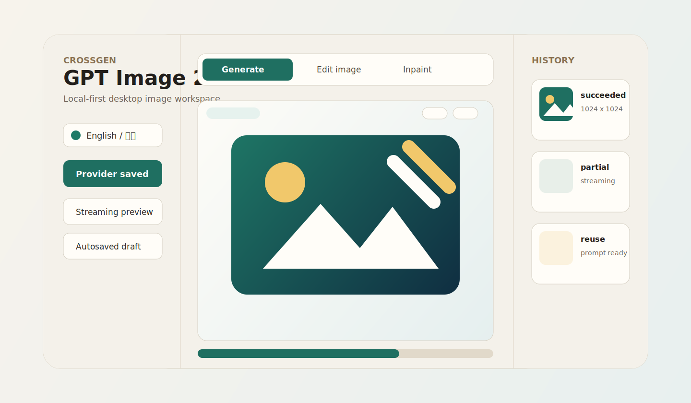
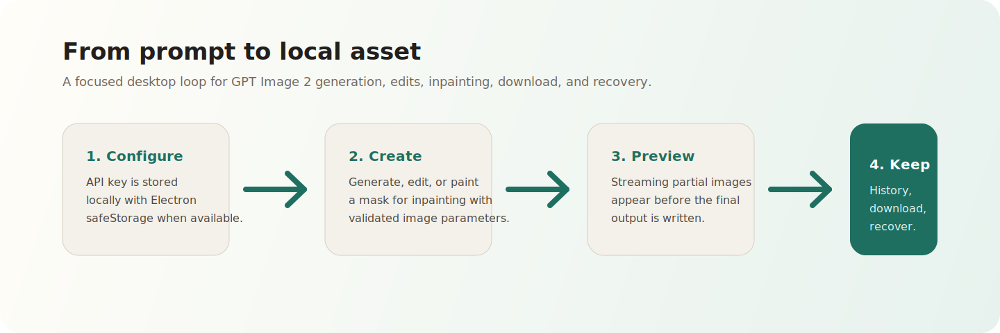
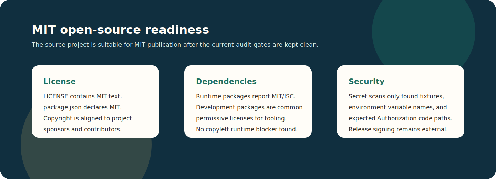

<div align="right">
  <details>
    <summary>Language</summary>
    <div align="right">
      <p><a href="#english">English</a></p>
      <p><a href="#simplified-chinese">简体中文</a></p>
    </div>
  </details>
</div>

<a id="english"></a>

<h1 align="center">
  
  <br />
  Image2Tools
</h1>

<p align="center">
  A local-first desktop workspace for GPT Image 2, Gemini-backed Nano Banana 3, and focused image-model fallback workflows.
</p>

<p align="center">
  <a href="./LICENSE"></a>
  
  
</p>

<p align="center">
  <a href="#features">Features</a> ·
  <a href="#showcase">Showcase</a> ·
  <a href="#open-source-status">Open Source Status</a> ·
  <a href="#development">Development</a> ·
  <a href="#about-the-sponsors">Sponsors</a> ·
  <a href="#simplified-chinese">简体中文</a>
</p>

## Showcase





## What Is Image2Tools

Image2Tools is a focused desktop client for image-generation workflows. The current main branch supports GPT Image 2 through the OpenAI Image API, the app's Nano Banana 3 launch target through Gemini `gemini-3.1-flash-image`, and a minimal General launch mode for non-focused Gemini image models discovered by the app.

The app is built for non-developers, individual creators, product teams, and internal AI workflow builders who need a simple desktop tool instead of a cloud workspace or account system. The multi-model UI separates provider configuration, model discovery, launch-model selection, model-specific parameters, local history, and release verification so new providers can be added without weakening the existing GPT Image 2 path.

## Features

| Area | Capability |
| --- | --- |
| Provider setup | OpenAI and Gemini provider selection, per-provider Base URL defaults, saved key preview, and model discovery. |
| Launch models | GPT Image 2, Nano Banana 3, and General launch buttons with availability reasons from discovered models. |
| GPT Image 2 | Text-to-image, single/multi-image editing, exact-mask inpainting, streaming partial previews, and validated OpenAI Image API parameters. |
| Nano Banana 3 | Gemini `generateContent` image generation, reference-image editing, guided-region editing, aspect ratio, resolution, Thinking, and Search grounding controls. |
| General | Minimal Gemini-only fallback for discovered non-focused image models; prompt and reference images only, with no broad any-provider claim. |
| Local history | Generated assets are saved in Electron user data with provider/model chips and can be reused, opened, or downloaded. |
| Workspace recovery | Draft prompt, parameters, references, masks, and brush size are autosaved. |
| Bilingual UI | In-app language switch supports English and Simplified Chinese through localStorage. |
| Updates | Manifest-based update checks with platform and architecture matching. |
| Safety | Managed asset protocol prevents arbitrary local file exposure from previews. |

## Product Flow

1. Choose an OpenAI or Gemini provider, then save the API key and Base URL.
2. Run model discovery and pick GPT Image 2, Nano Banana 3, or General from the launch-model area.
3. Choose Generate, Edit, or Inpaint/Guided Region where the selected model supports it.
4. Tune model-specific parameters. GPT Image 2 exposes OpenAI Image API controls and streaming; Nano Banana 3 exposes Gemini image controls; General stays minimal.
5. Download results, open the local output folder, or reuse history prompts with their provider/model context.

## Open Source Status



Image2Tools is suitable to publish as an MIT-licensed open-source project based on the current repository audit:

| Check | Result |
| --- | --- |
| Project license | `LICENSE` contains the MIT license and `package.json` declares `MIT`. |
| Runtime dependencies | Production dependencies report MIT or ISC licenses. |
| Development dependencies | Development tooling licenses are permissive/common for build and test tooling; no copyleft runtime blocker was found. |
| Secrets | The current scan found test/mock keys, environment variable names, and expected Authorization code paths, but no real API key or certificate committed to tracked source. |
| Generated and local files | `.gitignore` excludes `node_modules/`, build output, release output, real API artifacts, logs, and env files. |
| Remaining release gates | Re-run the secret scan before publishing, and verify signed/notarized macOS builds plus native Windows/Linux packages before distributing binaries. |

This is an engineering readiness assessment, not legal advice. If the project will be published by a legal entity, run the final license and trademark review under that entity's normal process.

## Development

Requirements:

- Node.js and pnpm
- macOS, Windows, or Linux
- OpenAI or Gemini API access for real image generation

```bash
pnpm install
pnpm dev:electron
```

Build and test:

```bash
pnpm build
pnpm verify:mock-api
pnpm verify:mock-gemini-api
pnpm verify:mock-model-discovery
```

Packaging:

```bash
pnpm package:dir
pnpm package:mac
pnpm package:win
pnpm verify:release:mac
pnpm verify:release:windows
pnpm verify:release:linux
```

`pnpm build` runs type checks, Vitest, the renderer build, and the Electron main build. `pnpm verify:mock-api` exercises the mock OpenAI Image API path. `pnpm verify:mock-gemini-api` exercises Gemini `generateContent`, guided-region requests, request recording, and Gemini-style error paths. `pnpm verify:mock-model-discovery` checks OpenAI/Gemini discovery fixtures, missing focused-model cases, General Gemini candidate detection, and Gemini discovery auth errors. `pnpm package:dir` creates an unpacked app for local inspection. `pnpm package:mac` creates local ad-hoc macOS packages; use `pnpm package:mac:signed` only when Developer ID and notarization environment variables are configured.

`pnpm verify:release:windows` defaults to full native Windows verification, including the NSIS silent install, installed-app launch, and silent uninstall cycle. Hosted GitHub workflows use `IMAGE2TOOLS_WINDOWS_VERIFY_MODE=package-smoke` to keep installer PE checks and unpacked-app launch smoke coverage without depending on the hosted runner's installer policy.

## Mock API

Use the mock servers when you do not want to spend real API credits.

```bash
pnpm mock:openai
```

Then configure the app with:

```text
API Key: sk-mock-image2tools
Base URL: http://127.0.0.1:8787/v1
```

The OpenAI mock supports `/models`, `/images/generations`, and `/images/edits`. It returns valid PNG base64 data and streaming events, so it can verify local configuration, request handling, previews, saving, downloads, and history. It does not represent real GPT Image 2 quality.

```bash
pnpm mock:gemini
```

Then configure the app with:

```text
Provider: Gemini
API Key: mock-gemini-key
Base URL: http://127.0.0.1:8788/v1beta
```

The Gemini mock supports `/models`, `:generateContent`, request recording, and Gemini-style error responses. It returns deterministic PNG image parts and text parts for Nano Banana 3 text-to-image, reference editing, and guided-region requests. It does not represent real Gemini image quality.

Automated mock verification:

```bash
pnpm verify:mock-api
pnpm verify:mock-gemini-api
pnpm verify:mock-model-discovery
```

## Real API Acceptance

`pnpm verify:real-api` is intentionally cost-gated and currently covers the OpenAI GPT Image 2 path. It only sends real image requests when an API key is present and cost acceptance is explicit:

```bash
IMAGE2TOOLS_API_KEY=sk-... IMAGE2TOOLS_REAL_API_ACCEPT_COST=1 pnpm verify:real-api
```

Streaming acceptance requires an additional opt-in:

```bash
IMAGE2TOOLS_REAL_API_ACCEPT_STREAM_COST=1
```

Generated acceptance artifacts are written to `real-api-artifacts/`, which is ignored by git.

Gemini / Nano Banana 3 real API acceptance is documented in [EXTERNAL_ACCEPTANCE.md](./EXTERNAL_ACCEPTANCE.md). Main currently has mock Gemini automation, but no automated real Gemini verifier; run the external manual flow before marking Gemini real acceptance complete.

## Icon

The app icon is generated from the local project source at [`build/icon.svg`](./build/icon.svg). Derived packaging assets are kept in:

- [`build/icon.png`](./build/icon.png)
- [`build/icon.icns`](./build/icon.icns)
- [`build/icon.ico`](./build/icon.ico)
- [`build/icon.iconset/`](./build/icon.iconset)
- [`public/favicon.svg`](./public/favicon.svg)

The mark combines an image canvas, edit wand, and streaming/output lines to match the product's `gpt-image-2` workflow.

## Documentation

- [PLAN.md](./PLAN.md): roadmap, scope, and phase goals
- [MULTI_MODEL_PLAN.md](./MULTI_MODEL_PLAN.md): multi image-model architecture and rollout plan
- [MULTI_MODEL_TODO.md](./MULTI_MODEL_TODO.md): executable task list for GPT Image 2, Nano Banana 3, and General support
- [MULTI_MODEL_CHECKLIST.md](./MULTI_MODEL_CHECKLIST.md): acceptance checklist for multi-model support
- [RELEASE_NOTES.md](./RELEASE_NOTES.md): draft `v0.2.0` release notes and release gates
- [ARCHITECTURE.md](./ARCHITECTURE.md): architecture, data flow, and module split
- [TODO.md](./TODO.md): executable task list
- [CHECKLIST.md](./CHECKLIST.md): development and release checklist
- [COMPLETION_AUDIT.md](./COMPLETION_AUDIT.md): delivery evidence and validation commands
- [EXTERNAL_ACCEPTANCE.md](./EXTERNAL_ACCEPTANCE.md): real API, signing, notarization, and platform acceptance
- [SECURITY.md](./SECURITY.md): security and pre-publication checks
- [OPEN_SOURCE_AUDIT.md](./OPEN_SOURCE_AUDIT.md): MIT open-source readiness audit

## Security Checks Before Publishing

Run these before making the repository public or publishing a release:

```bash
pnpm build
pnpm verify:mock-api
pnpm verify:mock-gemini-api
pnpm verify:mock-model-discovery
rg -n "sk-[A-Za-z0-9_-]{8,}|AIza[A-Za-z0-9_-]{8,}|Bearer |Authorization|x-goog-api-key|apiKey|encryptedApiKey|secret|password|token|private|/Users/|[A-Za-z0-9._%+-]+@[A-Za-z0-9.-]+\\.[A-Za-z]{2,}|github\\.com/.+/milestone|release/tag|origin/archive" \
  -g '!node_modules' -g '!dist*' -g '!release' -g '!pnpm-lock.yaml'
find . -maxdepth 3 \( -name '.env*' -o -name '*.pem' -o -name '*.p12' -o -name '*.key' -o -name '*state*.json' -o -name '*secret*' \) \
  -not -path './node_modules/*' -print
git ls-files | rg '(^|/)(dist|dist-renderer|release|real-api-artifacts|node_modules)/|\.env|\.pem|\.p12|state\.json|\.DS_Store' || true
```

Expected hits include mock keys, test fixtures, environment variable names, Authorization or `x-goog-api-key` request code, and documentation that describes security checks. Real OpenAI keys, real Gemini keys, signing certificates, private release links, local state files, and personal paths should not appear.

## About The Sponsors

Image2Tools is provided by Nowo and Corgnitor.

Nowo, known in Chinese as 诺惟, focuses on AI-native product design and applied software workflows. Corgnitor, known in Chinese as 核炬科技, focuses on engineering implementation and productization of AI-enabled tools. Together they provide Image2Tools as a practical open-source desktop utility for image-generation workflows.

## License

Image2Tools is released under the [MIT License](./LICENSE).

---

<a id="simplified-chinese"></a>

# Image2Tools 简体中文

<p align="center">
  
</p>

<p align="center">
  一个面向 GPT Image 2、Gemini 支撑的 Nano Banana 3，以及重点图片模型兜底流程的本地优先桌面工作台。
</p>

<p align="center">
  <a href="#english">English</a> ·
  <a href="#功能亮点">功能亮点</a> ·
  <a href="#项目展示">项目展示</a> ·
  <a href="#mit-开源状态">MIT 开源状态</a> ·
  <a href="#开发运行">开发运行</a> ·
  <a href="#背后的企业">背后的企业</a>
</p>

## 项目展示


## 项目定位

Image2Tools 是一个聚焦图片生成工作流的桌面客户端。当前 main 分支支持通过 OpenAI Image API 使用 GPT Image 2，通过 Gemini `gemini-3.1-flash-image` 使用应用内的 Nano Banana 3 启动入口，并为应用探测到的非重点 Gemini 图片模型提供最小 General 兜底模式。

适合非开发人员、个人创作者、产品团队、AI 应用工程团队和需要轻量图像工作台的内部工具场景。多模型界面把服务商配置、模型探测、启动模型选择、模型专属参数、本地历史和发布验证拆开，便于后续扩展新 provider，同时不影响现有 GPT Image 2 链路。

## 功能亮点

| 模块 | 能力 |
| --- | --- |
| 服务配置 | OpenAI 与 Gemini 服务商选择、默认 Base URL、Key 脱敏预览和模型探测。 |
| 启动模型 | GPT Image 2、Nano Banana 3、General 启动按钮，并根据探测结果显示可用性原因。 |
| GPT Image 2 | 文生图、单图/多图编辑、精确 mask 局部重绘、流式局部预览和 OpenAI Image API 参数校验。 |
| Nano Banana 3 | Gemini `generateContent` 图片生成、参考图编辑、引导式区域编辑、画面比例、分辨率、Thinking 和 Search grounding 控件。 |
| General | 当前仅针对探测到的非重点 Gemini 图片模型提供最小兜底；只承诺 prompt 与参考图，不声明任意 provider 通用能力。 |
| 本地历史 | 输出资产保存在 Electron user data，历史条目显示 provider/model，可下载、打开目录、复用 prompt。 |
| 草稿恢复 | 自动保存 prompt、参数、参考图、mask 和画笔大小。 |
| 双语界面 | 应用内支持 English / 简体中文切换，语言选择保存在 localStorage。 |
| 自动升级 | 支持基于 manifest 的升级检查，按平台和架构匹配安装包。 |
| 安全边界 | 使用受限的本地资源协议预览受管图片，避免任意文件暴露。 |

## 产品流程

1. 选择 OpenAI 或 Gemini 服务商，保存 API Key 与 Base URL。
2. 执行模型探测，并在启动模型区选择 GPT Image 2、Nano Banana 3 或 General。
3. 根据模型能力选择生成、编辑或局部重绘 / 引导式区域编辑。
4. 调整模型专属参数：GPT Image 2 显示 OpenAI Image API 与 streaming 控件，Nano Banana 3 显示 Gemini 图片参数，General 保持最小能力。
5. 下载结果、打开本地输出目录，或从历史记录复用带有 provider/model 上下文的 prompt。

## MIT 开源状态


基于当前仓库审计，Image2Tools 可以作为 MIT 协议项目开源发布：

| 检查项 | 结论 |
| --- | --- |
| 项目许可证 | `LICENSE` 为 MIT 文本，`package.json` 声明 `MIT`。 |
| 运行时依赖 | 生产依赖许可证为 MIT 或 ISC。 |
| 开发依赖 | 构建和测试工具为常见宽松许可证，未发现运行时 copyleft 阻断项。 |
| 敏感信息 | 当前扫描只发现 mock key、测试数据、环境变量名和正常鉴权代码路径，未发现真实 API Key 或证书进入跟踪源码。 |
| 生成与本地文件 | `.gitignore` 已排除 `node_modules/`、构建产物、release 产物、真实 API 验收产物、日志和环境变量文件。 |
| 发布前剩余门禁 | 公开前应重新扫描敏感信息；分发二进制前应完成 macOS 签名/公证以及 Windows/Linux 原生验收。 |

以上是工程开源就绪判断，不构成法律意见。如果项目以公司主体发布，仍建议按公司流程进行最终许可证、商标和合规审查。

## 开发运行

环境要求：

- Node.js 与 pnpm
- macOS、Windows 或 Linux
- 如需真实生成图片，需要 OpenAI 或 Gemini API 访问权限

```bash
pnpm install
pnpm dev:electron
```

构建与测试：

```bash
pnpm build
pnpm verify:mock-api
pnpm verify:mock-gemini-api
pnpm verify:mock-model-discovery
```

打包：

```bash
pnpm package:dir
pnpm package:mac
pnpm package:win
pnpm verify:release:mac
pnpm verify:release:windows
pnpm verify:release:linux
```

`pnpm build` 会执行类型检查、Vitest、renderer 构建和 Electron main 构建。`pnpm verify:mock-api` 覆盖 mock OpenAI Image API 链路。`pnpm verify:mock-gemini-api` 覆盖 Gemini `generateContent`、引导式区域请求、请求记录和 Gemini 风格错误路径。`pnpm verify:mock-model-discovery` 覆盖 OpenAI/Gemini 探测 fixture、缺少重点模型时的状态、General Gemini 候选模型识别和 Gemini 探测鉴权错误。`pnpm package:dir` 生成未压缩应用目录，适合本地检查。`pnpm package:mac` 生成本地 ad-hoc macOS 包；具备 Developer ID 和公证环境变量后再使用 `pnpm package:mac:signed`。

`pnpm verify:release:windows` 默认执行完整原生 Windows 验证，包括 NSIS 静默安装、已安装应用启动和静默卸载。Hosted GitHub workflow 使用 `IMAGE2TOOLS_WINDOWS_VERIFY_MODE=package-smoke` 保留安装包 PE 检查和未压缩应用启动烟测，同时避开托管 runner 的安装器策略差异。

## Mock API 验证

没有真实 API Key 或不希望产生费用时，可以使用 mock 服务。

```bash
pnpm mock:openai
```

应用中填写：

```text
API Key: sk-mock-image2tools
Base URL: http://127.0.0.1:8787/v1
```

OpenAI mock 支持 `/models`、`/images/generations`、`/images/edits`，并返回有效 PNG base64 与流式事件，可验证本地配置、请求、预览、保存、下载和历史链路。它不代表真实 GPT Image 2 输出质量。

```bash
pnpm mock:gemini
```

应用中填写：

```text
Provider: Gemini
API Key: mock-gemini-key
Base URL: http://127.0.0.1:8788/v1beta
```

Gemini mock 支持 `/models`、`:generateContent`、请求记录和 Gemini 风格错误响应。它会为 Nano Banana 3 文生图、参考图编辑和引导式区域请求返回确定性的 PNG image parts 与 text parts，但不代表真实 Gemini 图片质量。

自动化 mock 验证：

```bash
pnpm verify:mock-api
pnpm verify:mock-gemini-api
pnpm verify:mock-model-discovery
```

## 真实 API 验收

`pnpm verify:real-api` 默认不会产生真实图片请求，且当前覆盖 OpenAI GPT Image 2 链路。必须设置 API Key 且显式确认成本后才会运行：

```bash
IMAGE2TOOLS_API_KEY=sk-... IMAGE2TOOLS_REAL_API_ACCEPT_COST=1 pnpm verify:real-api
```

流式验收需要额外确认：

```bash
IMAGE2TOOLS_REAL_API_ACCEPT_STREAM_COST=1
```

验收输出会写入被 git 忽略的 `real-api-artifacts/`。

Gemini / Nano Banana 3 真实 API 验收流程见 [EXTERNAL_ACCEPTANCE.md](./EXTERNAL_ACCEPTANCE.md)。当前 main 已有 Gemini mock 自动化，但尚无自动化真实 Gemini verifier；在完成外部手工流程前，不应把 Gemini 真实验收标记为完成。

## 图标

应用图标由本地项目源文件 [`build/icon.svg`](./build/icon.svg) 生成，派生文件包括：

- [`build/icon.png`](./build/icon.png)
- [`build/icon.icns`](./build/icon.icns)
- [`build/icon.ico`](./build/icon.ico)
- [`build/icon.iconset/`](./build/icon.iconset)
- [`public/favicon.svg`](./public/favicon.svg)

图形融合了图片画布、编辑魔棒和输出线条，对应 Image2Tools 的 `gpt-image-2` 工作流。

## 文档索引

- [PLAN.md](./PLAN.md): 总体开发计划、阶段目标、范围边界
- [MULTI_MODEL_PLAN.md](./MULTI_MODEL_PLAN.md): 多生图模型架构与阶段推进计划
- [MULTI_MODEL_TODO.md](./MULTI_MODEL_TODO.md): GPT Image 2、Nano Banana 3、General 支持的可执行任务清单
- [MULTI_MODEL_CHECKLIST.md](./MULTI_MODEL_CHECKLIST.md): 多模型支持验收检查清单
- [RELEASE_NOTES.md](./RELEASE_NOTES.md): `v0.2.0` 发布说明草稿与发布门禁
- [ARCHITECTURE.md](./ARCHITECTURE.md): 技术架构、数据流、模块拆分
- [TODO.md](./TODO.md): 可直接执行的任务清单
- [CHECKLIST.md](./CHECKLIST.md): 开发与发布检查清单
- [COMPLETION_AUDIT.md](./COMPLETION_AUDIT.md): 当前交付证据、验证命令和外部待办
- [EXTERNAL_ACCEPTANCE.md](./EXTERNAL_ACCEPTANCE.md): 真实 API、签名、公证、跨平台和 CI 外部验收步骤
- [SECURITY.md](./SECURITY.md): 开源前安全与敏感信息检查
- [OPEN_SOURCE_AUDIT.md](./OPEN_SOURCE_AUDIT.md): MIT 开源就绪审计记录

## 公开前安全检查

发布公开仓库或 release 前建议执行：

```bash
pnpm build
pnpm verify:mock-api
pnpm verify:mock-gemini-api
pnpm verify:mock-model-discovery
rg -n "sk-[A-Za-z0-9_-]{8,}|AIza[A-Za-z0-9_-]{8,}|Bearer |Authorization|x-goog-api-key|apiKey|encryptedApiKey|secret|password|token|private|/Users/|[A-Za-z0-9._%+-]+@[A-Za-z0-9.-]+\\.[A-Za-z]{2,}|github\\.com/.+/milestone|release/tag|origin/archive" \
  -g '!node_modules' -g '!dist*' -g '!release' -g '!pnpm-lock.yaml'
find . -maxdepth 3 \( -name '.env*' -o -name '*.pem' -o -name '*.p12' -o -name '*.key' -o -name '*state*.json' -o -name '*secret*' \) \
  -not -path './node_modules/*' -print
git ls-files | rg '(^|/)(dist|dist-renderer|release|real-api-artifacts|node_modules)/|\.env|\.pem|\.p12|state\.json|\.DS_Store' || true
```

mock key、测试 fixture、环境变量名、鉴权请求代码、`x-goog-api-key` 请求代码和安全检查文档属于预期命中；真实 OpenAI Key、真实 Gemini Key、签名证书、私有发布链接、本地状态文件和个人路径不应出现。

## 背后的企业

Image2Tools 由诺惟（Nowo）与核炬科技（Corgnitor）提供。

诺惟（Nowo）关注 AI 原生产品设计与应用软件工作流。核炬科技（Corgnitor）关注 AI 工具的工程实现与产品化落地。双方共同提供 Image2Tools，希望把图片生成、编辑和局部重绘这类高频能力沉淀为一个简单、可本地运行、可开源协作的桌面工具。

## 许可证

Image2Tools 使用 [MIT License](./LICENSE) 开源。
