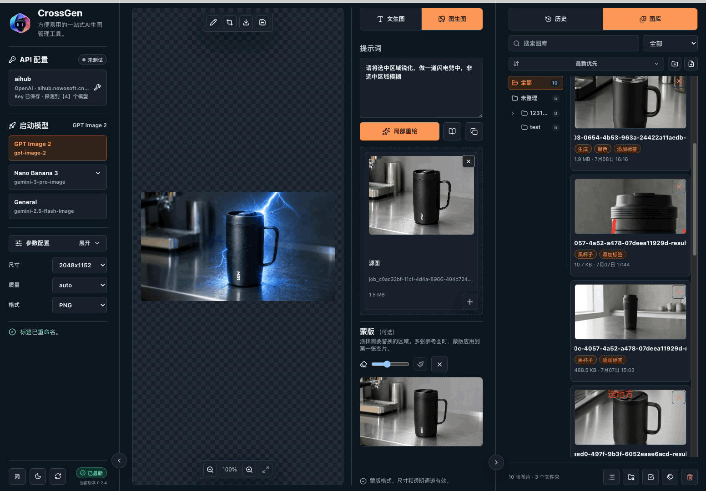

<h1 align="center">CrossGen</h1>

<p align="center">
  
</p>

<p align="center">
  <b>One local AI image workflow. Desktop, CLI, and MCP.</b><br />
  Generate, edit, organize, and export images from the visual app, scripts, or MCP-compatible agents.
</p>

<p align="center">
  <a href="https://github.com/Bliveren/CrossGen/releases"></a>
  <a href="https://github.com/Bliveren/CrossGen/actions/workflows/ci.yml"></a>
  <a href="./LICENSE"></a>
  
  
</p>

<p align="center">
  <b>English</b> · <a href="./README.zh-CN.md">简体中文</a>
</p>

<p align="center">
  <a href="https://github.com/Bliveren/CrossGen/releases/latest"><b>Download v0.3.3</b></a> ·
  <a href="#crossgen-artist-skill"><b>CrossGen Artist Skill</b></a> ·
  <a href="#agent-quickstart"><b>Agent Quickstart</b></a> ·
  <a href="./docs/cli-mcp.md"><b>CLI/MCP Docs</b></a> ·
  <a href="https://discord.gg/XphwmYtY">Discord</a>
</p>

<p align="center">
  <b>If you use Codex or another agent, start with <a href="#crossgen-artist-skill"><code>$crossgen-artist</code></a>.</b>
</p>

<p align="center">
  <a href="#why-crossgen-033">Why 0.3.3</a> ·
  <a href="#visual-tour">Visual Tour</a> ·
  <a href="#core-workflows">Core Workflows</a> ·
  <a href="#agent-runtime">Agent Runtime</a> ·
  <a href="#download-and-use">Install</a> ·
  <a href="#technical-notes">Technical Notes</a>
</p>

## Why CrossGen 0.3.3

CrossGen 0.3.3 makes the desktop image workspace more reliable for real production work. The visual app, CLI, and MCP share the same queue, provider diagnostics, reference-image handling, History, and Gallery flows, and the bundled crossgen-artist skill is built around that same contract so image generation remains usable even when a compatible provider needs a different route or a task needs retrying.

The desktop app, CLI, and MCP server share the same API profiles, durable generation queue, History, and Gallery. The bundled skill stays aligned with that contract. Install CrossGen once; installed CLI and MCP use require no separate Node.js, npm, pnpm, global package, or local HTTP service.

| Use CrossGen visually | Call the same runtime from an agent |
| --- | --- |
| Configure providers, generate and edit images, review History, and organize reusable Gallery assets. | Discover models, submit queue-backed generation or edits, monitor jobs, inspect Gallery assets, and export a selected result into the current project. |


### Agent Quickstart

Install and open the [latest desktop release](https://github.com/Bliveren/CrossGen/releases/latest), then add an API profile in **API access**. If you are using Codex or another agent, install the bundled CrossGen Artist Skill first; it keeps model discovery, queue jobs, and export behavior aligned with the app. The packaged `crossgen` launcher is ready for scripts, and the app executable can run as a local MCP stdio server.

```bash
crossgen doctor --agent --json
crossgen models list --json
crossgen generate --prompt "A precise isometric app icon" --yes --wait --json
```

Generate least-privilege MCP configuration for your client:

```bash
crossgen mcp config --client codex --mode readonly --json
crossgen mcp config --client claude-code --mode generate --json
crossgen mcp config --client cursor --mode generate --json
```

Start with `readonly`, then enable `write` or `generate` only when the agent needs it. Paid generation, asset export, destructive actions, queue-control changes, and local path disclosure require explicit permission or confirmation. See the [CLI and MCP guide](./docs/cli-mcp.md) for commands, tool coverage, modes, and installed executable paths.

### CrossGen Artist Skill

CrossGen ships a first-class agent workflow skill at [`skills/crossgen-artist`](./skills/crossgen-artist/). It is the recommended entry point for Codex and other compatible agents that need to discover model capabilities, choose generation/edit/inpaint operations, submit idempotent queue jobs, poll completion, inspect Gallery assets, and export results without exposing API keys or local paths by accident.

Install it for Codex from a CrossGen checkout:

```bash
mkdir -p "$HOME/.codex/skills"
ln -sfn "$(pwd)/skills/crossgen-artist" "$HOME/.codex/skills/crossgen-artist"
```

Then invoke it as `$crossgen-artist`. The skill is versioned with CrossGen so its instructions stay aligned with the bundled CLI/MCP contract. When CrossGen is installed as a packaged app, use the skill files from the matching source/release archive; a future installer will make this one click from Agent access.

The desktop **Agent access** panel remains the source of truth for MCP setup. Copy a client-specific snippet there, choose `readonly` for discovery, and switch to `write` or `generate` only for workflows that need those permissions. CrossGen does not silently edit Codex configuration or enable paid generation.

> Using CrossGen in a real desktop, CLI, or agent workflow? [Star the repository](https://github.com/Bliveren/CrossGen) so other local-first image-tool users can find it, and share the workflow in [Discord](https://discord.gg/XphwmYtY).

It is built for real image-generation work, not just one-off prompting. Designers, comic and storyboarding teams, UI makers, operators, product teams, and AI image hobbyists often need the same loop:

1. connect an image model with an API key,
2. generate a batch of ideas,
3. keep useful outputs,
4. crop, annotate, pick colors, or make quick edits,
5. reuse the result as a reference image,
6. generate again.

CrossGen keeps that whole loop inside one app. No repeated file hunting, no scattered browser downloads, no separate folder cleanup before the next image-to-image attempt.

For agent-driven work, the loop becomes equally direct:

1. inspect configured providers and verified model capabilities,
2. submit text-to-image or reference-image work,
3. track, cancel, or retry the queue-backed job,
4. inspect the resulting Gallery asset,
5. export it into the agent's current project.

## Visual Tour

<table>
<tr>
<td width="50%" valign="top">

<br />
<sub><b>API access and model switching.</b> Save API keys, switch access profiles, discover models, and let CrossGen pick the most compatible image route.</sub>
</td>
<td width="50%" valign="top">

<br />
<sub><b>History and Gallery become reusable references.</b> Drag results or saved assets directly into image-to-image reference slots.</sub>
</td>
</tr>
<tr>
<td width="50%" valign="top">

<br />
<sub><b>Edit without leaving the workflow.</b> Preview, crop, draw, add text, pick colors, save to Gallery, then use the edited image for the next generation.</sub>
</td>
<td width="50%" valign="top">

<br />
<sub><b>Dark mode.</b> A calmer workspace for long image-selection and editing sessions.</sub>
</td>
</tr>
</table>

## Core Workflows

### 1. One API Key Hub

CrossGen keeps API access simple:

- save multiple API keys and Base URLs,
- switch between OpenAI, Gemini, and OpenAI-compatible providers,
- run model discovery from the app,
- detect available image models,
- automatically probe compatible generation routes,
- keep the active API profile visible without crowding the workspace.

For aggregation platforms, route compatibility matters. CrossGen can prefer the route that actually works for the configured provider, including chat-style image generation paths used by compatible gateways.

### 2. Gallery And History That Actually Help

Generated images are not throwaway files. CrossGen treats them as reusable working material:

- History records every generation result with prompt, model, duration, and output actions.
- Gallery stores selected images as reusable assets.
- Gallery folders map to local files so assets remain manageable outside the app.
- Tags, folders, search, sorting, and compact/collapsed views keep large libraries usable.
- History and Gallery images can be clicked for preview/editing or dragged into image-to-image references.
- Right-click actions include local path copy for workflows that still need direct file access.

The goal is simple: the image you generated ten minutes ago should be easy to find, edit, and reuse.

### 3. Generate, Edit, Reuse, Generate Again

CrossGen includes a stronger image preview and editing area:

- crop results and save the selected region as a new image,
- draw quick annotations,
- add text boxes,
- pick colors from the image,
- save edited results into Gallery,
- use Gallery/history items as reference images,
- continue the next image-to-image round without leaving the app.

This makes CrossGen useful for iterative visual work: generate a base image, crop a detail, annotate or adjust it, save it, then feed it back into the next prompt.

## Other Highlights

- **GPT Image 2 and Gemini image workflows**: focused launch entries for GPT Image 2 and Nano Banana/Gemini image models.
- **Agent-ready CLI/MCP runtime**: local agents can discover providers and models, submit queue-backed image jobs, inspect status, and export Gallery assets.
- **Aggregation-provider compatibility**: release gates include real-provider validation through OpenAI-compatible aggregation endpoints and Gemini-compatible image models.
- **Durable generation queue**: generation and edit work runs through a bounded local queue with status tracking, retry, cancel, and safe defaults.
- **Prompt templates**: save reusable prompt structures and apply them quickly.
- **Prompt chips**: insert Gallery assets, color values, and templates into prompts.
- **Image-to-image reference handling**: drag local files, Gallery assets, or History outputs into reference slots.
- **Dark mode**: built for longer visual review sessions.
- **Local-first storage**: history, outputs, templates, and Gallery assets are stored locally.
- **Open source**: released under the MIT License.

## Agent Runtime

CrossGen 0.3.3 exposes the local image runtime through structured JSON CLI commands and an MCP stdio server. The same queue, diagnostics, and Gallery rules protect desktop, CLI, and MCP workflows:

- `crossgen doctor --agent --json` reports the app path, data directory, provider readiness, queue configuration, and MCP launch hints.
- `crossgen mcp config --client codex|claude-code|cursor --mode readonly|write|generate --json` prints client-ready MCP configuration.
- `crossgen generate ... --yes --wait --json` and MCP `crossgen_generate_image` submit work through the durable queue.
- `crossgen asset export <asset-id> --to <path> --yes --json` copies a managed image into a project without moving the Gallery source.

CLI and MCP are separate entry points. Packaged MCP configuration uses the bundled CLI launcher with `--mcp`; on macOS and Linux it reuses one per-user worker for parallel agent sessions. The launcher does not require Node.js, npm, pnpm, or a global package. CLI and MCP default to read-only behavior. Write and generation modes are explicit, paid generation requires confirmation, and local path disclosure is opt-in.

### Generate from a local agent or terminal

After configuring an API profile in the desktop app, use the packaged `crossgen` launcher:

```bash
crossgen doctor --agent --json
crossgen models list --json
crossgen generate --prompt "A precise isometric app icon" --yes --wait --json
crossgen job status <job-id> --json
crossgen asset export <asset-id> --to ./assets/app-icon.png --yes --json
```

Image editing uses the same queue and can accept a local reference image:

```bash
crossgen edit \
  --prompt "Keep the composition and change the background to white" \
  --input ./reference.png --yes --wait --json
```

All machine-facing responses are JSON. Read-only inspection omits API keys and absolute asset paths; paid generation, destructive actions, queue-control changes, exports, and path disclosure require explicit confirmation.

### Connect Codex, Claude Code, Cursor, or another MCP host

CrossGen can generate client-ready MCP configuration:

```bash
crossgen mcp config --client codex --mode readonly --json
crossgen mcp config --client claude-code --mode generate --json
crossgen mcp config --client cursor --mode generate --json
```

MCP uses the bundled launcher with `--mcp`; enabling a global `crossgen` shell command is not required. Choose the smallest permission mode that fits the workflow:

The packaged macOS/Linux launcher shares one local MCP worker across parallel
agent sessions. The runtime reclaims an otherwise idle session after 15 minutes
and exits when its host process disappears. Set
`CROSSGEN_MCP_IDLE_TIMEOUT_MS=0` to disable this guard.

| Mode | Agent capabilities |
| --- | --- |
| `readonly` | Inspect providers, models, capabilities, queue, jobs, folders, and Gallery assets |
| `write` | Read-only tools plus controlled Gallery and folder changes |
| `generate` | Write tools plus queue-backed image generation and editing |

Typical agent workflows include generating UI assets during coding, producing several visual directions and polling them as durable jobs, editing an existing reference image, and exporting selected Gallery results directly into a repository.

See [`docs/cli-mcp.md`](./docs/cli-mcp.md) for command examples and [`docs/KNOWN_LIMITATIONS.md`](./docs/KNOWN_LIMITATIONS.md) for current agent/runtime limits.

## Download And Use

CrossGen is distributed as a desktop release package. Download the latest installer from the [GitHub Releases page](https://github.com/Bliveren/CrossGen/releases/latest), install it, open the app, add your API key, and start generating.

| Platform | Package |
| --- | --- |
| macOS Apple Silicon | `.dmg` |
| Windows x64 | `.exe` installer |
| Linux x64 | AppImage |

Basic setup:

1. Open **API access**.
2. Add an API key and Base URL.
3. Run model discovery.
4. Launch GPT Image 2, Nano Banana/Gemini, or a compatible model.
5. Generate, edit, save useful images to Gallery, and reuse them as references.

The macOS arm64 release is Developer ID signed and Apple notarized. If Gatekeeper blocks a local unsigned build, right-click the app and choose **Open**, or clear the quarantine attribute:

```bash
xattr -dr com.apple.quarantine /Applications/CrossGen.app
```

If Windows SmartScreen appears, choose **More info** and then **Run anyway**.

## Brand

CrossGen means a cross-model, cross-step generation workspace: one local runtime for API access, generation, editing, Gallery management, repeated image-to-image iteration, and AI-agent workflows.

The product promise is deliberately practical:

> configure once, generate from the app or an agent, keep useful images organized, and reuse or export every result.

CrossGen is maintained by [Nowo](https://www.nowo.com/) and [Corgnitor](https://www.corgnitor.com/). Nowo focuses on AI-native product design and applied workflows. Corgnitor focuses on AI engineering and productization.

Join the CrossGen community on [Discord](https://discord.gg/XphwmYtY) for feedback, release discussion, and workflow ideas.

## Community and Contributions

- Ask usage questions, share workflows, and discuss early ideas in [GitHub Discussions](https://github.com/Bliveren/CrossGen/discussions).
- Report reproducible problems or scoped requests with the [issue templates](https://github.com/Bliveren/CrossGen/issues/new/choose).
- Read [CONTRIBUTING.md](./CONTRIBUTING.md) before submitting code or documentation.
- Report vulnerabilities privately according to [SECURITY.md](./SECURITY.md).

New contributors can start with [`good first issue`](https://github.com/Bliveren/CrossGen/labels/good%20first%20issue) or [`help wanted`](https://github.com/Bliveren/CrossGen/labels/help%20wanted) tasks.

## Technical Notes

CrossGen is an Electron + React + Tailwind desktop app. The app focuses on local-first workflows and supports OpenAI, Gemini, and compatible image providers.

Useful commands:

```bash
pnpm install
pnpm dev:electron
pnpm build
```

Validation:

```bash
pnpm verify:mock-api
pnpm verify:mock-gemini-api
pnpm verify:mock-model-discovery
pnpm verify:release-evidence
```

Packaging:

```bash
pnpm package:dir
pnpm package:mac
pnpm package:win
pnpm verify:release:mac
pnpm verify:release:windows
pnpm verify:release:linux
```

Release evidence is tracked in [`docs/release/evidence.json`](./docs/release/evidence.json). Mock verifiers do not spend real API credits. Real-provider gates require explicit cost approval and local environment variables.

## License

CrossGen is released under the [MIT License](./LICENSE).
