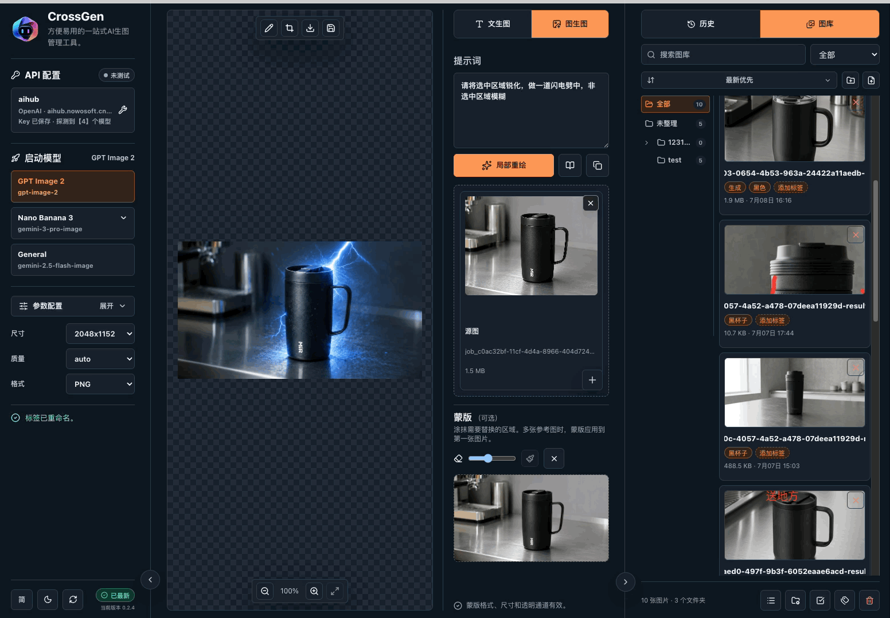

<h1 align="center">CrossGen</h1>

<p align="center">
  
</p>

<p align="center">
  <b>One local AI image workflow. Desktop, CLI, and MCP.</b><br />
  Generate, edit, organize, and export images from the visual app, scripts, or MCP-compatible agents.
</p>

<p align="center">
  <a href="https://github.com/Bliveren/CrossGen/releases"></a>
  <a href="https://github.com/Bliveren/CrossGen"></a>
  <a href="https://github.com/Bliveren/CrossGen/actions/workflows/ci.yml"></a>
  <a href="./LICENSE"></a>
  
  
</p>

<p align="center">
  <b>English</b> · <a href="./README.zh-CN.md">简体中文</a>
</p>

<p align="center">
  <a href="https://github.com/Bliveren/CrossGen/releases/latest"><b>Download v0.3.4 (latest release)</b></a> ·
  <a href="#applink-api-configuration"><b>AppLink</b></a> ·
  <a href="#crossgen-artist-skill"><b>CrossGen Artist Skill</b></a> ·
  <a href="#agent-quickstart"><b>Agent Quickstart</b></a> ·
  <a href="./docs/cli-mcp.md"><b>CLI/MCP Docs</b></a> ·
  <a href="https://discord.gg/XphwmYtY">Discord</a>
</p>

<p align="center">
  <b>If you use Codex or another agent, start with <a href="#crossgen-artist-skill"><code>$crossgen-artist</code></a>.</b>
</p>

<p align="center">
  <a href="#why-crossgen-035">Why 0.3.5 (in development)</a> ·
  <a href="#gpt-image-2-and-25">GPT Image 2 and 2.5</a> ·
  <a href="#visual-tour">Visual Tour</a> ·
  <a href="#core-workflows">Core Workflows</a> ·
  <a href="#agent-runtime">Agent Runtime</a> ·
  <a href="#download-and-use">Install</a> ·
  <a href="#technical-notes">Technical Notes</a>
</p>

## Why CrossGen 0.3.5 (In Development)

CrossGen 0.3.4 is **released**: it adds GPT Image 2.5 launch support, a media-aware foundation, and a confirmed AppLink import flow on top of the reliable 0.3.3 image workspace. v0.3.5 is **in development** and consolidates every feature and fix merged after that release: the GPT Image 2.5 Sketch input workspace and Input Studio integration, the strict model-discovery evidence contract (GPT Image 2 and 2.5 separated by exact provider model ID), the canonical Gemini image-model contract, capability-gated General image-to-image support, and the planned video technology preview. The visual app, CLI, and MCP keep sharing the same queue, provider diagnostics, reference-image handling, History, Gallery, and media metadata contracts, and the bundled crossgen-artist skill stays on the same path. **v0.3.5 is not released yet; the download link still points at v0.3.4.**

The desktop app, CLI, and MCP server share the same API profiles, durable generation queue, History, and Gallery. The bundled skill stays aligned with that contract. Install CrossGen once; installed CLI and MCP use require no separate Node.js, npm, pnpm, global package, or local HTTP service.

| Use CrossGen visually | Call the same runtime from an agent |
| --- | --- |
| Configure providers, generate and edit images, review History, and organize reusable Gallery assets. GIF/video assets can be imported and previewed within the supported desktop boundary. | Discover models, submit queue-backed generation or edits, monitor jobs, inspect image/GIF/video metadata, and export a selected result into the current project. |


### Agent Quickstart

Install and open the [latest desktop release](https://github.com/Bliveren/CrossGen/releases/latest), then add an API profile in **API access**. If you are using Codex or another agent, install the bundled CrossGen Artist Skill first; it keeps model discovery, queue jobs, and export behavior aligned with the app. The packaged `crossgen` launcher is ready for scripts and can start the local MCP stdio server with `--mcp`.

```bash
crossgen doctor --agent --json
crossgen models list --json
crossgen generate --prompt "A precise isometric app icon" --model gpt-image-2.5-sunburst --quality xhigh --yes --wait --json
```

Generate least-privilege MCP configuration for your client:

```bash
crossgen mcp config --client codex --mode readonly --json
crossgen mcp config --client claude-code --mode generate --json
crossgen mcp config --client cursor --mode generate --json
```

Start with `readonly`, then enable `write` or `generate` only when the agent needs it. Paid generation, asset export, destructive actions, queue-control changes, and local path disclosure require explicit permission or confirmation. See the [CLI and MCP guide](./docs/cli-mcp.md) for commands, tool coverage, modes, and installed executable paths.

### Codex Plugin

CrossGen ships a Codex plugin at [`plugins/crossgen`](./plugins/crossgen/) and
registers it in the repository marketplace at
[`.agents/plugins/marketplace.json`](./.agents/plugins/marketplace.json). The
plugin bundles the `crossgen-artist` skill together with a stdio MCP server
that launches the installed CrossGen app, so Codex can discover models, submit
queued jobs, and inspect Gallery assets through the same local runtime as the
desktop app. `CROSSGEN_MCP_MODE` defaults to `readonly`.

### CrossGen Artist Skill

CrossGen ships a first-class, media-aware agent workflow skill at [`skills/crossgen-artist`](./skills/crossgen-artist/). It is the recommended entry point for Codex and other compatible agents that need to discover model capabilities, choose generation/edit/inpaint operations, submit idempotent queue jobs, poll completion, inspect image/GIF/video metadata, and export results without exposing API keys or local paths by accident. The released v0.3.4 still does not expose real video generation or video editing; the planned v0.3.5 video technology preview does not promise a full video product either.

Install it for Codex from a CrossGen checkout:

```bash
mkdir -p "$HOME/.codex/skills"
ln -sfn "$(pwd)/skills/crossgen-artist" "$HOME/.codex/skills/crossgen-artist"
```

Then invoke it as `$crossgen-artist`. The skill is versioned with CrossGen so its instructions stay aligned with the bundled CLI/MCP contract, including GPT Image 2.5 model selection, Responses multi-turn edits, mask preflight, and media-aware Gallery reads. When CrossGen is installed as a packaged app, use the skill files from the matching source/release archive; a future installer will make this one click from Agent access.

The desktop **Agent access** panel remains the source of truth for MCP setup. Copy a client-specific snippet there, choose `readonly` for discovery, and switch to `write` or `generate` only for workflows that need those permissions. CrossGen does not silently edit Codex configuration or enable paid generation.

### AppLink API Configuration

CrossGen 0.3.4 ships a `crossgen://` AppLink for API aggregation platforms. An aggregator can open a provider import link and hand CrossGen its API name, Base URL, API Key, and optional model in one step. CrossGen shows a confirmation dialog before saving anything; after receiving the link, it stores the key with the existing local key protection and does not write it to logs or render it in full.

Canonical form:

```text
crossgen://provider/import?name=AIHub&kind=custom&base_url=https%3A%2F%2Fapi.example.com%2Fv1&api_key=sk-...&model=flux-pro
```

Accepted aliases include `apiKey`/`api_key`, `baseURL`/`base_url`, `defaultModel`/`default_model`, and `provider`/`kind`. Supported launch targets are `gpt-image-2`, `gpt-image-2.5`, `nano-banana-3`, and `general`; an AppLink model hint only seeds the initial config. After import, the latest successful discovery for that API Key is authoritative, and a launch is enabled only when the exact provider model ID is returned. `nano-banana-3` is a CrossGen launch/workflow alias, not a Gemini wire model id: pass a discovered provider id such as `gemini-3.1-flash-image`, `gemini-3.1-flash-lite-image`, or `gemini-3-pro-image` when selecting a specific Gemini model. Packaged builds register the `crossgen` scheme on macOS, Windows, and Linux.

> Using CrossGen in a real desktop, CLI, or agent workflow? [Star the repository](https://github.com/Bliveren/CrossGen) so other local-first image-tool users can find it, and share the workflow in [Discord](https://discord.gg/XphwmYtY).

It is built for real image-generation work, not just one-off prompting. Designers, comic and storyboarding teams, UI makers, operators, product teams, and AI image hobbyists often need the same loop:

1. connect an image model with an API key,
2. generate a batch of ideas,
3. keep useful outputs,
4. crop, annotate, pick colors, or make quick edits,
5. reuse the result as a reference image,
6. generate again.

CrossGen keeps that whole loop inside one app. No repeated file hunting, no scattered browser downloads, no separate folder cleanup before the next image-to-image attempt.

## GPT Image 2 and 2.5

CrossGen v0.3.5 (in development) keeps GPT Image 2 and GPT Image 2.5 as separate launch
families. A familiar model name is never treated as proof that the current API
Key can use it:

- `gpt-image-2` is the GPT Image 2 launch target.
- `gpt-image-2.5` is the CrossGen launch/AppLink compatibility alias. It is
  not a provider capability claim and is never injected as discovery evidence.
- `gpt-image-2.5-sunburst` and `gpt-image-2.5-flare` are concrete GPT Image
  2.5 provider targets; valid dated variants are accepted only when returned
  by the provider.
- `gpt-image-2.5-sunburst` is intended for precise edits, structure
  preservation, and high-fidelity reference work.
- `gpt-image-2.5-flare` is intended for fast, high-quality everyday generation.
- Valid dated base, Sunburst, and Flare snapshots are accepted when the
  provider exposes them.

The latest successful model discovery for the selected API Key is the
availability source of truth. CrossGen enables a GPT Image 2 or 2.5 launch only
after the exact provider model ID is confirmed by a lightweight image route.
Provider-listed rows may use a non-empty 2xx image response as confirmation even
when the optional metadata route is unavailable. If a gateway omits image
deployments from `/models`, CrossGen may try a small set of product-owned route
candidates; those candidates are launchable only when the successful payload
echoes the exact model ID (or exact metadata identity is paired with a
reachable validation route), and the UI labels them as route-confirmed rather
than provider-listed. Empty success envelopes such as `{ data: [] }`,
`{ output: [] }`, or `{ choices: [] }` only prove route reachability and cannot
enable a speculative candidate. A validation-only 400/422 is accepted only
when the metadata endpoint also echoed the same ID, so discovery does not need
to start a paid image generation. A different echoed ID is rejected, and a
response without an exact ID echo remains inconclusive for route candidates. A
row that is merely listed remains visible but disabled; `model_not_found` from
the metadata endpoint alone is `inconclusive`, while `model_not_found` from
every exact image route is `rejected`. A missing metadata route or transport
failure is also `inconclusive`. Explicit
`image_generation=false`, text-only, audio-only, or video-only declarations also
veto a launch. If
discovery returns only `gpt-image-2`, CrossGen shows only GPT Image 2; it does not
silently add GPT Image 2.5. If it returns only a 2.5 ID, CrossGen shows only GPT
Image 2.5. Replacing the API Key clears the previous discovery result before the
new probe completes. A failed or stale probe also clears the active model and
route until a later successful probe confirms a new exact model ID.

For focused launches, CrossGen derives the family and variant label from the
exact provider model ID. A gateway-supplied `displayName` is advisory, so it
cannot relabel `gpt-image-2` as GPT Image 2.5 (or the reverse). The same rule
applies to concrete 2.5 provider IDs and valid dated snapshots: when the
provider returns one, CrossGen keeps that exact ID for routing and shows it
alongside the friendly launch label. The bare `gpt-image-2.5` value remains a
compatibility alias for imported links and older drafts; it does not enable the
2.5 launch. For
OpenAI-compatible metadata, `name` is treated the same way: it may be a product
label, so only `id`, `model`, `model_id`, or `modelId` can confirm an exact GPT
Image deployment. Native Gemini metadata still uses `name: models/<id>` as its
canonical resource ID. When discovery promotes the active model, the desktop
editor parameters are synchronized to that confirmed model before the next run.
GPT Image 2.5 base, Sunburst, and Flare probes are aggregated independently; a
confirmed variant never enables a different variant.

Cross-protocol discovery gives the configured transport precedence. When the
primary protocol returns at least one runnable image model, its catalogue alone
drives the model picker; results from the alternate protocol are not merged.
The alternate protocol is used only when the primary response has no runnable
image model, and the inferred provider kind is recorded for routing. This keeps
protocol-incompatible or error-shaped gateway responses from enabling the wrong
focused launch.

OpenAI route evidence is bound to the exact provider model ID that was probed.
Switching between `gpt-image-2`, `gpt-image-2.5`, or a dated 2.5 variant clears
the old route evidence until the newly selected model is probed. The
read-only `pnpm probe:real-aihub-models` command checks GPT Image 2 and
GPT Image 2.5 family IDs independently. It also resolves the product launch
alias `nano-banana-3` to the actual Gemini provider IDs
`gemini-3.1-flash-image`, `gemini-3.1-flash-lite-image`, and
`gemini-3-pro-image`; it never treats the alias itself as a required Gemini
wire model. A gateway that lists a model but returns an explicit
`model_not_found` for `/models/{id}` is reported as `inconclusive` until an
exact image route confirms or rejects the same provider ID. Only when every
probed image route explicitly rejects that exact ID is the result `rejected`;
a generic missing metadata endpoint or transport failure remains
`inconclusive`. Neither state is presented as a launchable model.

The probe JSON keeps the evidence explicit: `family` is derived from the exact
provider ID, `exactIdMatch` means that ID appeared in `/models`,
`metadataStatus` describes the per-model endpoint, and only
`availability: "confirmed"` with `eligibleForLaunch: true` is launchable.
Metadata-only responses, ordinary HTTP failures, missing metadata routes, and
metadata-only `model_not_found` responses are `inconclusive`; metadata that
echoes a different model ID is `rejected`, and an explicit `model_not_found`
from every exact image route is `rejected`. Only
`confirmed` rows create an enabled model option. The legacy
`availableImageModels` field is retained for readers of older evidence and
means “image-looking IDs listed by `/models`”, not confirmed API-key access.
For new consumers, use `confirmedImageModels` or `launchableImageModels` for
the exact provider IDs that passed the read-only confirmation, and
`launchableTargetModels` for CrossGen launch aliases. The provider-id arrays
never contain the `nano-banana-3` workflow alias; a Gemini request must use the
confirmed `gemini-*` ID. `confirmedTargetModels` remains as a compatibility
alias for `launchableTargetModels`.
For a launch represented by several provider IDs, `matchedProviderModelIds`
shows the exact IDs returned by `/models`, and `providerProbes` preserves each
metadata result. This command is read-only and does not replace the desktop
runtime's exact-ID and route checks; it intentionally reports metadata
uncertainty conservatively.

The desktop, CLI, and MCP surfaces expose the same controls: `auto`, `low`,
`medium`, `high`, `xhigh`, and `max` quality; custom 16-multiple dimensions up
to the documented 4K envelope; transparent/opaque/automatic background;
PNG/JPEG/WebP output and JPEG/WebP compression; `n` up to 10; and streaming
partial images from 0 to 3. Edits support up to 16 reference images,
`input_fidelity`, and mask/inpainting with source/mask format and dimension
checks, alpha validation, and a 50 MB mask limit.

An optional `user` safety identifier is available in the desktop advanced
settings, CLI (`--user`), and MCP (`user`). CrossGen sends it as `user` through
the Images API and as `safety_identifier` through Responses. It must be an
opaque stable identifier; CrossGen never derives it from API keys or personal
account data.

GPT Image 2.5 can use the Image API or the Responses API image-generation tool.
Responses requests use a configurable mainline model (default `gpt-6-astra`)
and support `action`, `previous_response_id`, revised-prompt metadata, and
multi-turn editing. Responses streaming sends `partial_images` only when
partial previews are requested (1 to 3); a value of 0 omits the optional field.
GPT Image 2.5 never uses the legacy Chat Completions image
route. In automatic route mode, CrossGen uses the Images API for ordinary and
batch requests, and uses Responses only when conversation-specific controls are
present. Route probes are diagnostic only and do not silently promote a normal
2.5 request to the conversational path. Explicit Responses requests stay on
Responses if they fail, preserving conversation semantics instead of retrying
through a different billable route.

For privacy and lifecycle simplicity, v0.3.4 sends local Responses inputs as
base64 data URLs and does not upload or persist OpenAI Files API IDs. See the
[GPT Image 2.5 support research note](./docs/plans/gpt-image-2.5-support.md)
for the full capability matrix and official references.

For agent-driven work, the loop becomes equally direct:

1. inspect configured providers and verified model capabilities,
2. submit text-to-image or reference-image work,
3. track, cancel, or retry the queue-backed job,
4. inspect the resulting Gallery asset,
5. export it into the agent's current project.

## Gemini Image Models and Sketch (0.3.5 In Development)

CrossGen keeps the product launch name **Nano Banana 3** while preserving the
actual Gemini model id used by the provider. The current focused Gemini image
ids are:

- `gemini-3.1-flash-image` — the default Nano Banana 3 launch target;
- `gemini-3.1-flash-lite-image` — a distinct discovered Gemini image model;
- `gemini-3-pro-image` — a distinct discovered Gemini image model.

The desktop launch menu, History, CLI, and MCP retain the real provider id for
selection and traceability. For OpenAI-compatible gateways, that returned
`id` is the only family-classification source of truth; `display_name` is
advisory. A row such as `id: gpt-image-2.5, display_name: GPT Image 2` remains
a disabled compatibility row and does not prove GPT Image 2.5 support. Explicit text-only, audio-only, video-only,
or `image_generation=false` metadata can veto an image-looking id. Older
drafts and AppLinks containing `nano-banana-3` are migrated to
`gemini-3.1-flash-image`; CrossGen never sends the alias as the Gemini request
model. The current API key's model-discovery response is authoritative: a
model that is not discovered, or whose capability metadata does not confirm
image editing and reference images, remains disabled for Sketch and is blocked
before a paid request.

Sketch is an image-to-image input workflow inside the existing desktop workspace,
not a third top-level mode. The user creates or reopens a Sketch in the
reference-image area, draws it in Input Studio, optionally adds a view-only
reference underlay, and saves it as the first input image. CrossGen records
`workflow: "sketch"` and Sketch provenance in History/CLI/MCP metadata, while
the provider request continues to use the validated image-edit route. CrossGen
does not invent or send a provider-native `scratch` field, and Sketch cannot be
combined with a mask.

The code and deterministic/mocked contracts for GPT Image 2.5 and the Gemini
focused launches are present in v0.3.5. The final release gate still requires a
real AIHub GPT Image 2.5/Nano Banana 3 quality, latency, failure-recovery, and
privacy matrix; the presence of Gemini provider IDs confirms the Nano Banana
launch mapping but does not replace real workflow acceptance. Mock or
compatibility-model responses do not replace that gate.

## Visual Tour

<table>
<tr>
<td width="50%" valign="top">

<br />
<sub><b>API access and model switching.</b> Save API keys, switch access profiles, discover models, and let CrossGen pick the most compatible image route.</sub>
</td>
<td width="50%" valign="top">

<br />
<sub><b>History and Gallery become reusable references.</b> Drag results or saved assets directly into image-to-image reference slots.</sub>
</td>
</tr>
<tr>
<td width="50%" valign="top">

<br />
<sub><b>Edit without leaving the workflow.</b> Preview, crop, draw, add text, pick colors, save to Gallery, then use the edited image for the next generation.</sub>
</td>
<td width="50%" valign="top">

<br />
<sub><b>Dark mode.</b> A calmer workspace for long image-selection and editing sessions.</sub>
</td>
</tr>
</table>

## Core Workflows

### 1. One API Key Hub

CrossGen keeps API access simple:

- save multiple API keys and Base URLs,
- switch between OpenAI, Gemini, and OpenAI-compatible providers,
- run model discovery from the app,
- detect available image models,
- automatically probe compatible generation routes,
- keep the active API profile visible without crowding the workspace.

For aggregation platforms, route compatibility matters. CrossGen can prefer the route that actually works for the configured provider, including chat-style image generation paths used by compatible gateways.

### 2. Gallery And History That Actually Help

Generated images are not throwaway files. CrossGen treats them as reusable working material:

- History records every generation result with prompt, model, duration, and output actions.
- Gallery stores selected images as reusable assets.
- Gallery folders map to local files so assets remain manageable outside the app.
- Tags, folders, search, sorting, and compact/collapsed views keep large libraries usable.
- History and Gallery images can be clicked for preview/editing or dragged into image-to-image references.
- Right-click actions include local path copy for workflows that still need direct file access.

The goal is simple: the image you generated ten minutes ago should be easy to find, edit, and reuse.

### 3. Generate, Edit, Reuse, Generate Again

CrossGen includes a stronger image preview and editing area:

- crop results and save the selected region as a new image,
- draw quick annotations,
- add text boxes,
- pick colors from the image,
- save edited results into Gallery,
- use Gallery/history items as reference images,
- continue the next image-to-image round without leaving the app.

This makes CrossGen useful for iterative visual work: generate a base image, crop a detail, annotate or adjust it, save it, then feed it back into the next prompt.

## Other Highlights

- **GPT Image 2 / 2.5 and Gemini image workflows**: focused launch entries for GPT Image 2.5 Sunburst/Flare, legacy GPT Image 2, and Nano Banana/Gemini image models.
- **Agent-ready CLI/MCP runtime**: local agents can discover providers and models, submit queue-backed image jobs, inspect status, and export Gallery assets.
- **Aggregation-provider compatibility**: release gates include real-provider validation through OpenAI-compatible aggregation endpoints and Gemini-compatible image models.
- **Durable generation queue**: generation and edit work runs through a bounded local queue with status tracking, retry, cancel, and safe defaults.
- **Prompt templates**: save reusable prompt structures and apply them quickly.
- **Prompt chips**: insert Gallery assets, color values, and templates into prompts.
- **Image-to-image reference handling**: drag local files, Gallery assets, or History outputs into reference slots.
- **Dark mode**: built for longer visual review sessions.
- **Local-first storage**: history, outputs, templates, and Gallery assets are stored locally.
- **Open source**: released under the MIT License.

## Agent Runtime

CrossGen exposes the local image runtime through structured JSON CLI commands and an MCP stdio server. The same queue, diagnostics, and Gallery rules protect desktop, CLI, and MCP workflows:

- `crossgen doctor --agent --json` reports the app path, data directory, provider readiness, queue configuration, and MCP launch hints.
- `crossgen mcp config --client codex|claude-code|cursor --mode readonly|write|generate --json` prints client-ready MCP configuration.
- `crossgen generate ... --yes --wait --json` and MCP `crossgen_generate_image` submit work through the durable queue.
- `crossgen asset export <asset-id> --to <path> --yes --json` copies a managed image into a project without moving the Gallery source.

CLI and MCP are separate entry points. Packaged MCP configuration uses the bundled CLI launcher with `--mcp`; on macOS, Windows and Linux it reuses one per-user worker for parallel agent sessions. The launcher does not require Node.js, npm, pnpm, or a global package. CLI and MCP default to read-only behavior. Write and generation modes are explicit, paid generation requires confirmation, and local path disclosure is opt-in.

### Generate from a local agent or terminal

After configuring an API profile in the desktop app, use the packaged `crossgen` launcher:

```bash
crossgen doctor --agent --json
crossgen models list --json
crossgen generate --prompt "A precise isometric app icon" --model gpt-image-2.5-sunburst --quality xhigh --yes --wait --json
crossgen job status <job-id> --json
crossgen asset export <asset-id> --to ./assets/app-icon.png --yes --json
```

Image editing uses the same queue and can accept a local reference image:

```bash
crossgen edit \
  --prompt "Keep the composition and change the background to white" \
  --input ./reference.png --yes --wait --json
```

All machine-facing responses are JSON. Read-only inspection omits API keys and absolute asset paths; paid generation, destructive actions, queue-control changes, exports, and path disclosure require explicit confirmation.

### Connect Codex, Claude Code, Cursor, or another MCP host

CrossGen can generate client-ready MCP configuration:

```bash
crossgen mcp config --client codex --mode readonly --json
crossgen mcp config --client claude-code --mode generate --json
crossgen mcp config --client cursor --mode generate --json
```

MCP uses the bundled launcher with `--mcp`; enabling a global `crossgen` shell command is not required. Choose the smallest permission mode that fits the workflow:

The packaged macOS/Linux launcher shares one local MCP worker across parallel
agent sessions. The runtime reclaims an otherwise idle session after 15 minutes
and exits when its host process disappears. Set
`CROSSGEN_MCP_IDLE_TIMEOUT_MS=0` to disable this guard.

| Mode | Agent capabilities |
| --- | --- |
| `readonly` | Inspect providers, models, capabilities, queue, jobs, folders, and Gallery assets |
| `write` | Read-only tools plus controlled Gallery and folder changes |
| `generate` | Write tools plus queue-backed image generation and editing |

Typical agent workflows include generating UI assets during coding, producing several visual directions and polling them as durable jobs, editing an existing reference image, and exporting selected Gallery results directly into a repository.

See [`docs/cli-mcp.md`](./docs/cli-mcp.md) for command examples and [`docs/KNOWN_LIMITATIONS.md`](./docs/KNOWN_LIMITATIONS.md) for current agent/runtime limits.

## Download And Use

CrossGen is distributed as a desktop release package. Download the latest installer from the [GitHub Releases page](https://github.com/Bliveren/CrossGen/releases/latest), install it, open the app, add your API key, and start generating.

| Platform | Package |
| --- | --- |
| macOS Apple Silicon | `.dmg` |
| Windows x64 | `.exe` installer |
| Linux x64 | AppImage |

Basic setup:

1. Open **API access**.
2. Add an API key and Base URL.
3. Run model discovery.
4. Launch GPT Image 2.5, GPT Image 2, Nano Banana/Gemini, or a compatible model.
5. Generate, edit, save useful images to Gallery, and reuse them as references.

The macOS arm64 release is Developer ID signed and Apple notarized. If Gatekeeper blocks a local unsigned build, right-click the app and choose **Open**, or clear the quarantine attribute:

```bash
xattr -dr com.apple.quarantine /Applications/CrossGen.app
```

If Windows SmartScreen appears, choose **More info** and then **Run anyway**.

## Brand

CrossGen means a cross-model, cross-step generation workspace: one local runtime for API access, generation, editing, Gallery management, repeated image-to-image iteration, and AI-agent workflows.

The product promise is deliberately practical:

> configure once, generate from the app or an agent, keep useful images organized, and reuse or export every result.

CrossGen is maintained by [Nowo](https://www.nowo.com/) and [Corgnitor](https://www.corgnitor.com/). Nowo focuses on AI-native product design and applied workflows. Corgnitor focuses on AI engineering and productization.

Join the CrossGen community on [Discord](https://discord.gg/XphwmYtY) for feedback, release discussion, and workflow ideas.

## Community and Contributions

- Ask usage questions, share workflows, and discuss early ideas in [GitHub Discussions](https://github.com/Bliveren/CrossGen/discussions).
- Report reproducible problems or scoped requests with the [issue templates](https://github.com/Bliveren/CrossGen/issues/new/choose).
- Read [CONTRIBUTING.md](./CONTRIBUTING.md) before submitting code or documentation.
- Report vulnerabilities privately according to [SECURITY.md](./SECURITY.md).

New contributors can start with [`good first issue`](https://github.com/Bliveren/CrossGen/labels/good%20first%20issue) or [`help wanted`](https://github.com/Bliveren/CrossGen/labels/help%20wanted) tasks.

## Technical Notes

CrossGen is an Electron + React + Tailwind desktop app. The app focuses on local-first workflows and supports OpenAI, Gemini, and compatible image providers.

Useful commands:

```bash
pnpm install
pnpm dev:electron
pnpm build
```

Validation:

```bash
pnpm verify:mock-api
pnpm verify:mock-gemini-api
pnpm verify:mock-model-discovery
pnpm verify:release-evidence
```

Packaging:

```bash
pnpm package:dir
pnpm package:mac
pnpm package:win
pnpm verify:release:mac
pnpm verify:release:windows
pnpm verify:release:linux
```

Release evidence is tracked in [`docs/release/evidence.json`](./docs/release/evidence.json). Mock verifiers do not spend real API credits. Real-provider gates require explicit cost approval and local environment variables.

## License

CrossGen is released under the [MIT License](./LICENSE).
