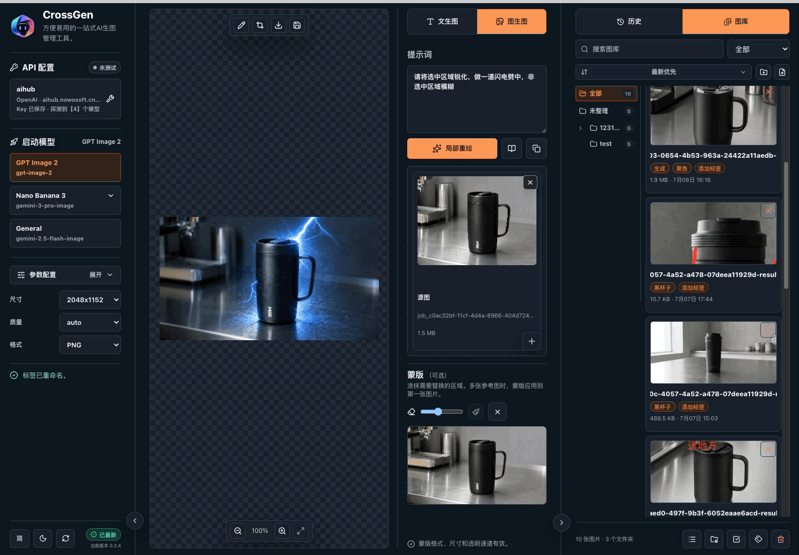

<h1 align="center">CrossGen 0.3.0</h1>

<p align="center">
  
</p>

<p align="center">
  <b>一站式 AI 生图管理工具。</b><br />
  配 API、探测模型、快速生图、编辑图片、管理图库、复用参考图，都在一个桌面应用里完成。
</p>

<p align="center">
  <a href="https://github.com/Bliveren/CrossGen/releases"></a>
  <a href="https://github.com/Bliveren/CrossGen/actions/workflows/ci.yml"></a>
  <a href="./LICENSE"></a>
  
  
</p>

<p align="center">
  <a href="./README.md">English</a> · <b>简体中文</b>
</p>

<p align="center">
  <a href="#为什么是-crossgen-030">0.3.0 介绍</a> ·
  <a href="#功能演示">功能演示</a> ·
  <a href="#核心工作流">核心工作流</a> ·
  <a href="#下载安装">下载安装</a> ·
  <a href="https://discord.gg/XphwmYtY">Discord</a> ·
  <a href="#技术说明">技术说明</a>
</p>

## 为什么是 CrossGen 0.3.0

从 0.3.0 开始，Image2Tools 正式升级为 CrossGen。它不再只是一个“调用模型出图”的小工具，而是面向日常生图人员的一站式 AI 生图管理工作台。

它解决的是很实际的工作问题：

1. API Key 多、Base URL 多、模型多，切换和排错很麻烦；
2. 生出来的图散落在下载目录、本地文件夹和聊天记录里，很难复用；
3. 好不容易有一张可用图，还要到别的软件里裁剪、批注、取色，再重新上传做参考；
4. 历史图、素材图、参考图之间不连通，图生图迭代效率很低。

CrossGen 把这些环节放在一个桌面应用里：配置 API、自动探测模型与路径、生成图片、编辑图片、保存到图库、从图库或历史拖回参考图区域，再进入下一轮图生图。

适合平面设计、漫剧制作、UI 制作、运营配图、产品原型、内部 AI 工具团队，以及只是想更方便地使用生图模型的用户。

## 功能演示

<table>
<tr>
<td width="50%" valign="top">

<br />
<sub><b>一站式 API 配置与模型切换。</b>保存多个 API Key 和 Base URL，自动探测模型与可用路径，快速切换不同模型。</sub>
</td>
<td width="50%" valign="top">

<br />
<sub><b>图库与历史直接变成参考图。</b>历史结果和图库素材可以直接拖到图生图参考区，不用反复找文件、上传文件。</sub>
</td>
</tr>
<tr>
<td width="50%" valign="top">

<br />
<sub><b>简单易用的图片编辑。</b>预览、裁剪、涂鸦、加文本、取色、保存到图库，再继续用于下一轮生图。</sub>
</td>
<td width="50%" valign="top">

<br />
<sub><b>暗色模式。</b>长时间选图、修图、对比结果时更舒服。</sub>
</td>
</tr>
</table>

## 核心工作流

### 1. 一站式 API Key 配置与管理

CrossGen 0.3.0 将 API 配置从“技术配置项”变成日常可用的工作入口：

- 保存多个 API Key 和 Base URL；
- 支持 OpenAI、Gemini 以及各类 OpenAI 兼容聚合平台；
- 一键探测模型；
- 自动识别可用生图模型；
- 自动探测更适合当前服务商的生成路径；
- 当前使用的 API 配置始终清楚可见，但不挤占主工作区。

对于聚合平台来说，同一个模型可能不是每条接口路径都可用。CrossGen 会尽量使用当前平台真正能返回图片的路径，减少“接口明明通了但就是不出图”的情况。

### 2. 高效易用的图库与历史管理

生图用户真正需要的不是“生成完就结束”，而是把有价值的图沉淀下来、快速复用：

- 历史记录保存每一次生图结果、提示词、模型和耗时；
- 图库用于集中管理值得保存的图片素材；
- 图库打通本地文件夹，用户既可以在 CrossGen 中管理，也可以在本地文件夹中整理；
- 支持文件夹、标签、搜索、排序和折叠浏览；
- 历史和图库图片都可以点击预览或编辑；
- 历史和图库图片都可以直接拖到图生图参考图区域；
- 右键可复制本地绝对路径，方便与外部软件协作。

目标很简单：刚生成的图、之前保存的图、某个文件夹里的参考图，都应该马上找得到、拿得出来、用得上。

### 3. 生图、编辑、再生图的高效循环

0.3.0 的图片编辑区不再只是预览结果，而是串联图库和图生图的核心区域：

- 生成后直接预览；
- 快速裁剪图片；
- 可将裁剪区域另存为新图；
- 支持涂鸦、文本框、取色；
- 编辑后的图片可以保存到图库；
- 图库图片又可以拖回参考区，继续作为下一轮图生图输入。

这让 CrossGen 更适合连续创作：先生成一个基础方向，裁剪或标注关键区域，保存成素材，再立刻进入下一轮生成。

## 其他特点

- **GPT Image 2 与 Gemini/Nano Banana 图像模型**：面向重点图片模型提供清晰启动入口。
- **聚合平台兼容验证**：0.3.0 已通过 OpenAI 兼容聚合端点的 GPT Image 2 与 Gemini 图像模型真实生图门禁。
- **提示词模板**：常用提示词可以保存、搜索、复用。
- **Prompt Chips**：在提示词中插入图库素材、颜色值和模板。
- **图生图参考图管理**：本地图片、图库素材、历史结果都可以成为参考图。
- **暗色模式**：适合长时间选图、对图和编辑。
- **本地优先存储**：历史、输出、模板、图库资产保存在本地。
- **MIT 开源**：可以自由使用、研究和协作改进。

## 下载安装

CrossGen 提供 release 安装包。到 [GitHub Releases](https://github.com/Bliveren/CrossGen/releases/latest) 下载对应平台安装包，安装后打开应用，填写 API Key 即可使用。

| 平台 | 安装包 |
| --- | --- |
| macOS Apple Silicon | `.dmg` |
| Windows x64 | `.exe` 安装程序 |
| Linux x64 | 发布时提供 AppImage |

基本使用流程：

1. 打开 **API 配置**；
2. 填写 API Key 和 Base URL；
3. 执行模型探测；
4. 启动 GPT Image 2、Nano Banana/Gemini 或兼容模型；
5. 输入提示词生图；
6. 将有用的结果保存到图库；
7. 从历史或图库拖回参考图区域，继续图生图。

如果 macOS Gatekeeper 拦截未公证的本地构建，可右键应用选择 **打开**，或清除隔离属性：

```bash
xattr -dr com.apple.quarantine /Applications/CrossGen.app
```

如果 Windows 出现 SmartScreen 提示，选择 **更多信息**，再点击 **仍要运行**。

## 品牌定位

CrossGen 的含义是跨模型、跨步骤的生成工作台。它把 API 配置、生图、编辑、图库管理、历史复用和图生图迭代连接起来。

一句话定位：

> CrossGen 是一站式 AI 生图管理工具。

产品承诺很直接：

> API 配好一次，图片快速生成；有用结果集中管理；简单编辑不离开应用；所有素材都能进入下一轮生图。

CrossGen 由 [诺惟 Nowo](https://www.nowo.com/) 与 [核炬科技 Corgnitor](https://www.corgnitor.com/) 共同维护。

诺惟关注 AI 原生产品设计、产品策略和应用工作流；核炬科技关注 AI 工程实现与产品化落地。CrossGen 是双方共同沉淀的开源桌面工具。

欢迎加入 [CrossGen Discord 社区](https://discord.gg/XphwmYtY)，反馈问题、讨论版本和交流生图工作流。

## 技术说明

CrossGen 使用 Electron、React 和 Tailwind 构建。本节面向开发、测试和发布维护人员；普通用户下载安装包即可使用。

开发运行：

```bash
pnpm install
pnpm dev:electron
pnpm build
```

验证：

```bash
pnpm verify:mock-api
pnpm verify:mock-gemini-api
pnpm verify:mock-model-discovery
pnpm verify:release-evidence
```

打包：

```bash
pnpm package:dir
pnpm package:mac
pnpm package:win
pnpm verify:release:mac
pnpm verify:release:windows
pnpm verify:release:linux
```

发布门禁记录在 [`docs/release/evidence.json`](./docs/release/evidence.json)。Mock 验证不会消耗真实 API 额度；真实 provider 验证需要显式授权并配置本地环境变量。

## 许可证

CrossGen 使用 [MIT License](./LICENSE) 开源。
